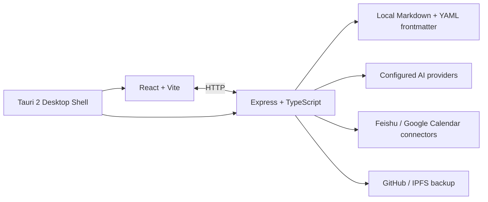

<div align="center">


# DailyFlow

> **把无限待办，收敛成今天真正要推进的事**
>
> 本地优先的任务、笔记、日历与 AI 工作台。


**当前稳定版：v2.3.0** · **Sprint 1 已合并 (10 缺口 + 4 文档)** · [下载与安装说明](https://github.com/frankfika/dailyflow/releases/latest) <!-- x-release-please-version -->

[核心功能](#-核心功能) · [界面预览](#-界面预览) · [快速开始](#-快速开始) · [开发](#-开发) · [文档](#-文档)

__简体中文__ | [English](./README_EN.md)

</div>

## DailyFlow 是什么？

DailyFlow 面向被待办过载、会议和零散想法拉扯的人。它把收集、计划、执行和回顾放在同一个桌面工作区里，同时让 Markdown 文件保留在你的本地目录中。

它的核心原则很简单：

1. **先收集**：把任务、想法和会议输入 Inbox 或笔记。
2. **再聚焦**：在 Today 中决定今天推进什么，处理等待项和遗留项。
3. **最后回顾**：用 Memory 和 Review 沉淀已确认的工作上下文。

如果你不想把工作资料锁在单一 SaaS 里，又希望拥有 AI 辅助整理和连接外部日历的能力，DailyFlow 就是为这个取舍设计的。

## 🆕 Sprint 1 已落地（路演前 4 周冲刺完成）

> 2026-08-20 合并到 main · 9 个新 commit · 645 测试通过 / 0 TS 错误

| 类别 | 能力 | 路演页 |
|---|---|---|
| **P0** | 脑图节点 7 种类型（task/question/resource/risk/branch/tag/root） | Slide 04 |
| **P0** | AI 整理脑图：by_topic / by_priority / by_time 三策略 | Slide 04 |
| **P0** | 主动提案：逾期 5 天任务自动建议排进今天 | Slide 06 |
| **P0** | Memory 3 层搜索：结构化 > 元数据 > 全文 | Slide 06 |
| **P0** | 本地 Whisper 后端选择（whisper.cpp） | Slide 05 |
| **P1** | 日报 + 今日复盘（Journal/YYYY-MM-DD.md） | Slide 03 |
| **P1** | 任务完成回写脑图节点（status=done + 完成块） | Slide 04 |
| **P2** | 向量索引（TF-IDF in-memory，lancedb-ready） | Slide 12 |
| **P2** | Skill 市场雏形（GitHub registry + SHA-256 校验） | Slide 12 |
| **P2** | 隐私面板（5 类外发请求透明展示） | Slide 05 |

详细设计：[`docs/ROADSHOW_VS_PRODUCT_GAP.md`](./docs/ROADSHOW_VS_PRODUCT_GAP.md) · [`CHANGELOG.md`](./CHANGELOG.md)

## ✨ 核心功能

### Today：每天从一个清晰的工作面开始

- 今日任务、逾期项、完成数和聚焦进度集中呈现。
- 支持手动选择今日重点，也支持 AI 根据时间、精力和约束提出计划。
- 未完成事项可以回顾、迁移；等待中的事项不会被误当成今天要做的事。
- Work / Life 上下文切换，让不同场景的任务互不干扰。

### Inbox 与 AI 工作流

- 快速捕获未经处理的任务、信息和想法。
- AI 可以从自然语言中提取任务、笔记和后续行动。
- 所有 AI 变更先以 proposal 形式展示，确认后才写入本地数据。
- 支持多会话 AI Chat、上下文挂载、Prompt Library 和 Agent Skill / Slash Command。

### Notes：文档优先的笔记

- 普通笔记、每日笔记、会议记录和 AI 总结统一管理。
- 列表 + 编辑器分栏布局，并支持专注模式。
- 笔记可关联任务、按人员筛选，并作为上下文发送到 AI Chat。
- Markdown 文件作为可读、可迁移的本地数据。


### Mind Map：把复杂问题拆成主分支

- **🆕 7 种节点类型**：`task`（任务）/ `question`（疑问）/ `resource`（资料）/ `risk`（风险）/ `branch`（分支）/ `tag`（标签）/ `root`（根），每种独立图标和颜色。
- **🆕 AI 整理**：工具栏「AI 整理」按钮提供 by_topic（按类型）/ by_priority（按状态）/ by_time（按日期标签）三种策略，结果以可撤销的"建议单"形式呈现，确认后才落盘。
- 新增 `思维导图` 标签，每个工作区一组导图，独立的平移/缩放画布（基于 `@xyflow/react`）。
- 自动水平布局，拖拽改位置，`Tab` 加子节点、`Enter` 加同级节点、`Backspace` 删除、双击 / `F2` 编辑，色板按钮切换 6 个命名色。
- 子树折叠/展开、节点内联备注、Markdown 导出、撤销/重做（50 步历史）、画布内 `Ctrl/Cmd+F` 搜索。
- 每个节点有 `todo` / `in-progress` / `done` 三态进度，header 实时显示完成度。
- **🆕 任务回写**：任务完成时自动回写到关联节点（追加 `## 完成 · YYYY-MM-DD` 块 + status=done），思考过程永远保留在原位。
- 5 个内置模板（SWOT、5W1H、决策树、任务分解、风险评估），JSON 导入/导出。
- 自动保存到 `<workspaceRoot>/.dailyflow/mindmaps/<id>.json`（600ms 防抖）。

### Events：像飞书脑图笔记一样拆解项目

- 左侧大纲 + 右侧画布的双 pane 布局，项目和行动一目了然。
- 大纲支持单击直接编辑，`Enter` 创建同级、`Tab` 创建子级、`↑↓` 移动、`Backspace` 删除空节点。
- 画布节点常驻 `+` 按钮，一键添加子节点或同级节点。
- 画布节点可自由拖拽定位，位置持久化到 mindmap JSON；空白处拖拽平移画布，滚轮 + 缩放控件缩放，整体可在滚动区任意方向滚动。
- 新建事件后画布中央直接输入第一个步骤，零门槛开始拆解。
- 节点通过「添加为任务」转成任务：弹出日期浮层（今天 / 明天 / +3 天 / 下周 / 自定义日期），点「安排」确认后才排期，不再一键硬塞今天。
- 节点 chip、大纲行、底部工具栏三个入口共用同一个日期浮层；任务节点带绿色侧条和日期标记，可改期、移出日程或直接标记完成，Today 里能看到来源事件和节点路径。
- **🆕 AI 推进（Event Operator）**：事件详情右上角「AI 推进」会先展示本次发送的 Event、Evidence 和 Commitment 范围，确认后由打包的 DeepSeek Harness sidecar 运行受限 Agent。运行过程支持实时阶段、取消、断线重连和恢复；候选节点、边、Commitment、Decision 与 Outcome 可在画布上逐项审阅，接受后才原子写入。**确认前正式数据零写入**，revision 冲突、重复提交和部分失败均有防护；模型只能看到 7 个 DailyFlow 白名单工具，不暴露 Shell、文件写入、Terminal 或任意 MCP。详见 [DeepSeek Harness 实施计划](./docs/DAILYFLOW_2_2_DEEPSEEK_HARNESS_IMPLEMENTATION_PLAN.md)。


### Topic Spaces：跨工作区的语义分组

- 新增 `主题`（Topic Space）维度，把一个项目 / 议题 / 长期目标的所有素材串起来。
- 每个主题有独立的思维导图（默认视图），Work / Life 上下文隔离。
- 节点右键：Promote（把分支节点升级成真实 Task）/ Link（关联已有 Task）/ Set Tag / Unclassify。
- Task 可以绑定到主题，列表视图按主题筛选，按 Tag 二次筛选，绑定状态在 TaskCard 上清晰可见。
- Markdown 文件里的 `^space:<id>` 系统标记是绑定关系的唯一权威来源，迁移 / 备份天然兼容。
- 提供 broken-link 诊断 + repair 接口，发现并清理指向已删除 Task 的悬挂节点。

### Calendar：把任务和日程放在一条时间线上

- 支持日、周、月视图。
- 聚合本地任务、定时笔记和外部日历事件。
- 本地任务、定时笔记和已配置的外部日历事件统一显示在时间线上。
- 外部日历连接器仅在完成正式授权和配置后开放；未配置时不会显示为可用能力。

### Memory 与 Review：让工作有上下文

- **🆕 3 层搜索排序**：结构化关联（linkedTaskIds / linkedNoteIds 直接命中） > 元数据（title / tag / status / date） > 全文（FTS5 / LIKE），每个 hit 带 `matchTier` 徽章。
- **🆕 向量索引**（可选加速）：TF-IDF + cosine similarity，> 1000 entity 时自动提示升级到 lancedb。
- **🆕 主动提案**：扫描 memory 里的承诺 / 任务 / 等待项，发现"关联任务已逾期 5 天"自动生成 Proposal 推到 Today 顶部。三条限制：全局开关 / 静默时段（深夜不提）/ 每周最多 3 次。
- Memory 聚合已确认的 Commitment、项目、会议、人员、决定和结果。
- Review 展示每周工作摘要、仍在进行的事项和长期未推进的 Commitment。
- v2 数据模型按实体保存，并保留审计与导入/导出能力。

### 日报与日复盘

- **🆕** Today 顶部「今日复盘」按钮，归档后自动生成 `Journal/YYYY-MM-DD.md`。
- 内容：今日完成 / 进行中 / 推迟 / 复盘问题 / 明日聚焦。
- `builtin_daily_report` Skill：让 LLM 帮你草拟复盘正文（与 `weekly_report` 风格一致）。

### Skill 市场与社区扩展

- **🆕** 从 `dailyflow-skills` GitHub registry 一键安装社区 Skill。
- **🆕** SHA-256 校验 + manifest schema（`docs/agent-market/community-skills-registry.example.json`）。
- 已安装的 Skill 在 AIChat skill 选择器中与内置 Skill 平级出现。

### 隐私与 0 字节上传

- **🆕** 设置 → 隐私 Tab：`PrivacyPanel` 列出全部 5 类外发请求（AI Chat / 会议转写 / IPFS / OAuth / 升级检查），每类都有显式开关。
- 详细审计：[`docs/ZERO_UPLOAD_AUDIT.md`](./docs/ZERO_UPLOAD_AUDIT.md)。

### 会议转写

- **🆕** 后端可切换：OpenAI Whisper（云端，1 行配置） / 本地 whisper.cpp（推荐，主权 AI 承诺）。
- 详见 [`docs/LOCAL_WHISPER_SETUP.md`](./docs/LOCAL_WHISPER_SETUP.md)。

### 同步、备份与桌面体验

- Git / GitHub 同步本地工作区。
- Pinata IPFS 备份，生成可追踪的 CID。
- Tauri 桌面应用内置 Node.js 与 Feishu CLI 运行时，普通用户无需另装 Node、npm 或 Homebrew。
- macOS、Windows、Linux 桌面安装包支持应用内更新。

## 🤖 AI 模型

通过设置页配置 AI provider，支持国内、海外、聚合平台以及任意 OpenAI-compatible API。当前代码覆盖 B.AI、OpenRouter、OpenAI、Anthropic、Google Gemini、DeepSeek、Kimi、MiniMax、智谱 GLM、豆包、Qwen、SiliconFlow、Groq 等 provider；具体可用模型取决于 provider 的 API 配置。


> AI 功能需要用户自行配置 API Key。DailyFlow 不托管你的模型凭据，也不会把本地 Markdown 工作区上传到 DailyFlow 服务。

## 📸 界面预览

| Today | AI Chat |
|:---:|:---:|
|  |  |

| Notes | Settings |
|:---:|:---:|
|  |  |

截图来自真实运行的本地应用；如界面发生变化，可运行 `node scripts/capture-screenshots.mjs` 更新素材。文档中的外部连接能力以当前授权状态为准，不会用演示数据填充列表。

## 🚀 快速开始

### 下载桌面版

从 [最新 Release](https://github.com/frankfika/dailyflow/releases/latest) 下载对应平台的安装包。桌面安装包会携带本地服务运行所需的 Node.js；首次使用时只需选择一个 Markdown 工作区目录。

| 平台 | 常见安装包 |
|:---|:---|
| macOS Apple Silicon | `DailyFlow_*_aarch64.dmg` |
| macOS Intel | `DailyFlow_*_x64.dmg` |
| Windows | `DailyFlow_*_x64-setup.exe` |
| Linux | `DailyFlow_*_amd64.AppImage` |

macOS 安装后请将 DailyFlow 拖入“应用程序”。由于当前构建尚未经过 Apple 公证，如果提示“DailyFlow 已损坏”或无法验证开发者，请执行：

```bash
sudo xattr -rd com.apple.quarantine "/Applications/DailyFlow.app"
```

然后在 Finder 中右键 DailyFlow，选择“打开”。完整说明见 [MACOS_DAMAGED_FIX.md](./docs/MACOS_DAMAGED_FIX.md)。

### 从源码运行

开发环境要求：Node.js 20+。

```bash
git clone https://github.com/frankfika/dailyflow.git
cd dailyflow
npm install

# 前端 + 本地 Express 服务
npm run dev:all

# 或以 Tauri 桌面应用运行
npm run tauri dev
```

打开 <http://localhost:47831> 后，按引导选择工作区。生产构建：

```bash
npm run build
npm run build:server
npm run tauri build
```

## 🧭 开发

```bash
npm run lint          # TypeScript 类型检查
npm test              # Vitest 单元与服务测试
npm run test:coverage # 覆盖率报告
npm run build         # Vite 生产构建
```

项目结构：

```text
src/                  React + TypeScript 前端
server/               Express API、v2 domain 与本地 Markdown repository
src-tauri/            Tauri 2 桌面壳与内置运行时
scripts/              构建、打包、截图和验收脚本
e2e/                  Playwright 端到端测试
docs/                 产品、架构、数据格式与发布文档
```

## 🏗 架构



## 📚 文档

**Sprint 1 设计文档**
- [产品债务清单（28 条）](./docs/PRODUCT_DEBT.md)
- [V2 16 页全量对账表](./docs/FEATURE_AUDIT.md)
- [0 字节上传路径审计](./docs/ZERO_UPLOAD_AUDIT.md)
- [Skill 市场 v2 规划](./docs/AGENT_MARKET_V2.md)
- [V2 路演 vs 实际产品 差距分析](./docs/ROADSHOW_VS_PRODUCT_GAP.md)
- [脑图 AI 整理（3 策略）](./docs/MINDMAP_AI_ORGANIZE.md)
- [主动提案机制](./docs/PROACTIVE_PROPOSAL.md)
- [Memory 3 层搜索](./docs/MEMORY_SEARCH_TIERS.md)
- [任务回写脑图](./docs/TASK_MIRROR_TO_MINDMAP.md)
- [日报与日复盘](./docs/DAILY_REPORT.md)
- [本地 Whisper 设置指南](./docs/LOCAL_WHISPER_SETUP.md)
- [向量索引（lancedb-ready）](./docs/VECTOR_INDEX.md)
- [Agent 市场（Skill 安装）](./docs/AGENT_MARKET.md)

**架构与流程**
- [AI-native 产品开发规范](./docs/AI_NATIVE_PRODUCT_DEVELOPMENT_SPEC.md)
- [架构说明](./docs/ARCHITECTURE.md)
- [数据格式](./docs/DATA_FORMAT.md)
- [日历与 Feishu 同步](./docs/MAIL_WORKSPACE_PLAN.md)
- [发布流程](./docs/RELEASE_PROCESS.md)
- [完整变更记录](./CHANGELOG.md)

## 🤝 贡献

欢迎提交 Issue、改进建议和 Pull Request。提交前请确保 `npm run lint`、`npm test` 和相关构建通过；提交信息遵循 Conventional Commits（如 `feat:`、`fix:`、`docs:`、`test:`）。

## 📄 License

Apache License 2.0。代码文件中的 SPDX 标识和项目发布配置均采用 Apache-2.0；如果需要贡献代码，请在 PR 中说明新增依赖的许可证兼容性。

<div align="center">

[⭐ Star on GitHub](https://github.com/frankfika/dailyflow) · [📥 下载最新版本](https://github.com/frankfika/dailyflow/releases/latest) · [🐛 报告问题](https://github.com/frankfika/dailyflow/issues)

</div>
