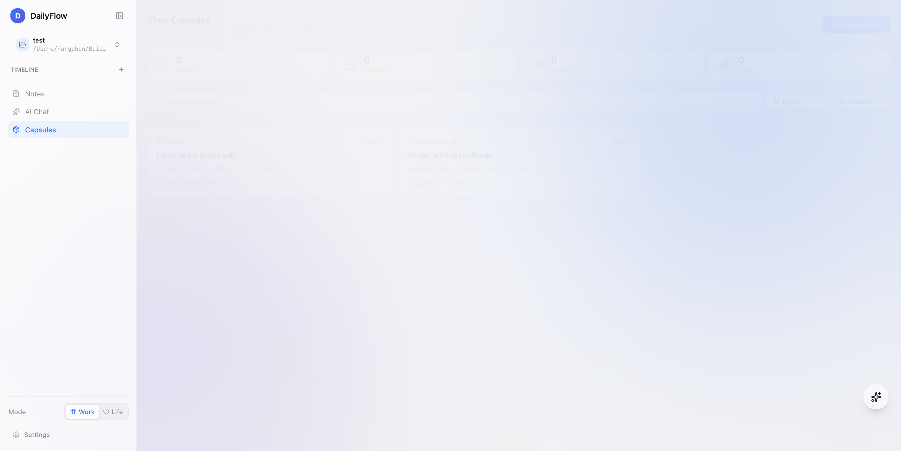

<div align="center">


# DailyFlow

> **把无限待办，收敛成今天的三件事**
>
> 每天少承诺一点，真正完成一点。数据只存在你的本地 Markdown 里。


[核心功能](#-核心功能) · [界面预览](#-界面预览) · [时间胶囊](#-时间胶囊) · [快速开始](#-快速开始) · [技术栈](#-技术栈) · [贡献](#-贡献)

__简体中文__ | [English](./README_EN.md)

---

</div>

> [!IMPORTANT]
> 当前 README 描述的是已实现版本及其过渡中的 Today’s Three 体验。下一代 AI-native 产品的开发主规范是 [`docs/AI_NATIVE_PRODUCT_DEVELOPMENT_SPEC.md`](./docs/AI_NATIVE_PRODUCT_DEVELOPMENT_SPEC.md)。后续产品、数据模型和开发决策以该文档为准。

## ✦ 下一版：Today’s Three

大多数任务工具擅长帮你**收集更多**，DailyFlow 现在只解决一个更具体的问题：

> 当待办越积越多时，今天到底该做什么？

每天打开应用，AI 会先读完你的待办、优先级、截止日期和积压时间。你只需告诉它一句今天的现实限制，它会提出三件「今日承诺」并解释取舍；你可以继续用自然语言重排，也可以随时手动调整。

1. **收集**：把脑中的事情快速记进收集箱
2. **收敛**：只选今天最值得推进的三件事
3. **完成**：一次只盯下一件，完成后获得清晰的闭环
4. **回顾**：其余任务留在待办池，不用把“没做完”当成失败

---

## 📖 项目简介

DailyFlow 是一个为「待办过载」设计的 **本地优先（local-first）每日聚焦工具**。Markdown 文件是唯一数据源；AI、笔记和时间胶囊是辅助工具，核心始终是帮助你决定并完成今天最重要的三件事。

### 为什么选择 DailyFlow？

| 传统方式 | DailyFlow |
|---------|-----------|
| 打开应用先看到一整墙欠下的任务 | 先选「今日三件事」，其余自动退到背景 |
| 完成多少都觉得不够 | 三件完成即可明确收工 |
| 数据锁在 SaaS 平台 | 本地 Markdown，完全可控 |
| 需要网络才能使用 | 离线优先，**内置 Node.js 运行时** |
| 复杂项目管理工具上手难 | 不管理整个组织，只帮助你过好今天 |

---

## ✨ 核心功能

### 🎯 今日三件事（vNext）

- **AI 每日规划**：一句话描述时间、精力和硬约束，AI 直接生成今日三件事
- **解释而非黑盒**：明确说明为什么选这三件、哪些事情可以等待
- **持续重排**：情况变化后用一句话让 AI 重新规划
- **人工掌控**：任何时候都可以切换为手动选择
- **单一视觉重点**：选中后从普通列表移出，不再重复争夺注意力
- **明确进度**：实时显示 0/3 → 3/3，完成即闭环
- **本地记忆**：按日期、工作区和 Work/Life 模式分别保存

### 📋 任务管理

- **自动迁移**：未完成任务在次日自动迁移，保留来源日期标记
- **卡片式界面**：任务按标签分类，支持评论、关联笔记
- **Work/Life 切换**：一键切换工作/生活上下文，任务自动过滤
- **标签系统**：支持 `#tag`、`#deadline:日期`、`#priority:级别`、`#project:名称`

### 📅 日历工作区

- **统一日历视图**：在侧边栏直接进入日历，按天、周或月查看任务、定时笔记和外部日程
- **多来源聚合**：将 DailyFlow 本地内容与已连接的企业日历汇总到同一时间轴
- **飞书日程**：读取飞书日历并显示日程详情，可从 DailyFlow 跳转到原始日程
- **可扩展连接器**：连接器插件层已支持飞书，Google Calendar 接口预留中

### ⏳ 时间胶囊（实验性工具）

- **三种胶囊类型**：Commitment（承诺）、Secret（秘密）、Milestone（里程碑）
- **多链 EVM**：Base Sepolia、Optimism Sepolia、Arbitrum Sepolia、Sepolia、本地 Hardhat
- **钱包连接**：支持 MetaMask / Rabby 等任何 injected 钱包
- **链上哈希**：内容用 keccak256 哈希上链，原文留在本地（隐私可控）
- **时间锁**：智能合约在 unlockAt 之前保证内容不可见
- **可验证**：每条胶囊都带 tx hash + 区块浏览器链接
- **趣味 UI**：SVG 插画 + 渐变背景 + 倒计时动效


### 🤖 AI 助手

- **AI Chat**：完整聊天界面，多会话上下文注入（今日任务/笔记/项目）
- **AI Tool Use**：AI 可直接创建任务、保存笔记
- **Brain Dump**：把零散想法倒进去，AI 自动提取和分类
- **AI 总结**：选择范围和提示词，生成结构化日报/周报
- **Skill Marketplace**：技能市场，支持 Slash Command 和 Agent Skill
- **提示词库**：管理和测试 AI 格式化提示词模板


### 🔌 AI 模型支持

一键配置，支持 15+ AI 供应商：

| 类型 | 供应商 |
|------|--------|
| 聚合平台 | **B.AI**（29+ 模型一个 Key）、OpenRouter |
| 国内 | DeepSeek、Kimi、MiniMax、智谱 GLM、豆包、阿里云 Qwen、硅基流动 |
| 海外 | Anthropic Claude、OpenAI、Google Gemini、Groq |
| 自定义 | 任何 OpenAI 兼容 API |

### 📝 笔记系统

- **多类型**：普通笔记、会议记录、AI 总结
- **只读预览**：点击卡片进入只读预览，点编辑按钮再改，避免误编辑
- **AI 助手**：润色、续写、提取待办、整理会议纪要
- **发到对话**：把笔记作为上下文绑定到 AI 对话，输入框只留你的提问
- **@提及**：`@人名` 自动解析，支持按人员筛选
- **任务关联**：笔记与任务双向关联


### 📚 多笔记本 / 工作区

- 侧边栏一键切换多个 Markdown 工作区
- 自动发现本地笔记文件夹
- 每个工作区记住最后停留日期
- 工作台和笔记、任务共用同一棵文件树

### 🔄 同步与备份

- **飞书双向同步**：同步任务标题、描述、截止日和完成状态；定时会议笔记可推送到飞书日历
- **Git 同步**：一键提交到 GitHub，侧边栏显示同步状态
- **IPFS 备份**：通过 Pinata 上传去中心化备份，获得永久 CID
- **应用内更新**：自动检测新版本，一键下载安装

---

## 📸 界面预览

| 主界面 (Today) | 项目概览 |
|:---:|:---:|
|  |  |

| AI Chat | 笔记 |
|:---:|:---:|
|  |  |

| 时间胶囊列表 | 时间胶囊详情 |
|:---:|:---:|
|  |  |

---

## ⏳ 时间胶囊

### 是什么？

**时间胶囊（Time Capsule）** 是 DailyFlow 的第三个独立标签页。它让你把 **承诺、秘密、人生里程碑** 写下来，用 **真实 EVM 智能合约** 把内容哈希锁在区块链上，等到了未来的某一天再打开。

> 这不是公开日记（隐私敏感），也不是普通备忘录（缺乏仪式感）—— 它是「写给未来的自己/朋友」的密封信封，由去中心化网络见证。

### 怎么工作？

```
┌─────────────────┐         ┌──────────────────────┐         ┌─────────────────────┐
│  本地：写胶囊     │  keccak256  │  EVM 链上：存哈希     │  unlockAt  │  本地：解锁打开       │
│  title / content │ ───────▶ │  contentHash + 时间锁  │ ───────▶ │  验证 + 全文展示     │
│  type / unlockAt │   哈希    │  capsules[id]        │   触发    │  可链上 reveal      │
└─────────────────┘         └──────────────────────┘         └─────────────────────┘
```

- **写胶囊**：在本地存全文 + 元数据，同时调用合约 `seal(bytes32 contentHash, uint256 unlockAt, CapsuleType, bool isPublic)`
- **存链上**：智能合约记录 `id → creator → hash → unlockAt → status`
- **等解锁**：客户端检测 `unlockAt <= now` 后把胶囊标记为「可打开」
- **拆胶囊**：本地展示全文；可选调用合约 `reveal(id, status)` 公开状态

### 三种胶囊类型

| 类型 | 含义 | 推荐场景 |
|------|------|---------|
| 🎯 Commitment | 承诺 | 立 flag、戒断目标、年度计划 |
| 🤫 Secret | 秘密 | 给未来某天的自己写一封信 |
| 🏆 Milestone | 里程碑 | 毕业、买房、升职、宝宝出生 |

### 多链支持

| 链 | Chain ID | 浏览器 | 状态 |
|----|---------|--------|------|
| Base Sepolia | 84532 | https://sepolia.basescan.org | 部署后填入 |
| Optimism Sepolia | 11155420 | https://sepolia-optimism.etherscan.io | 部署后填入 |
| Arbitrum Sepolia | 421614 | https://sepolia.arbiscan.io | 部署后填入 |
| Sepolia | 11155111 | https://sepolia.etherscan.io | 部署后填入 |
| Hardhat (本地) | 31337 | - | ✅ 内置 |

### 部署合约到测试网

```bash
cd contracts
cp .env.example .env  # 填入 PRIVATE_KEY 和 RPC URL

# 编译 + 测试
npm install --legacy-peer-deps
npx hardhat compile
npx hardhat test

# 部署到指定链
npx hardhat run scripts/deploy.ts --network baseSepolia
npx hardhat run scripts/deploy.ts --network arbitrumSepolia

# 部署结果保存在 contracts/deployments.json
# 把链 ID 对应的合约地址填到 src/config/chains.ts 的 CHAIN_CONTRACTS
```

### 技术细节

- **合约**：[contracts/contracts/DailyFlowCapsule.sol](./contracts/contracts/DailyFlowCapsule.sol)
- **ABI**：[src/contracts/abi.ts](./src/contracts/abi.ts)
- **前端 hook**：[src/hooks/useCapsuleContract.ts](./src/hooks/useCapsuleContract.ts)
- **钱包连接**：[src/components/WalletConnectButton.tsx](./src/components/WalletConnectButton.tsx)
- **链配置**：[src/config/chains.ts](./src/config/chains.ts)
- **后端服务**：[server/services/capsule.ts](./server/services/capsule.ts)（落库真实 tx 数据）

---

## 🚀 快速开始

### 📦 下载安装（推荐）

前往 [Releases](https://github.com/frankfika/dailyflow/releases/latest) 下载对应平台安装包：

| 平台 | 文件 | 大小 |
|------|------|------|
| macOS (Apple Silicon) | `DailyFlow_x.x.x_aarch64.dmg` | ~33 MB |
| macOS (Intel) | `DailyFlow_x.x.x_x64.dmg` | ~35 MB |
| Windows | `DailyFlow_x.x.x_x64-setup.exe` | ~30 MB |
| Linux | `DailyFlow_x.x.x_amd64.AppImage` | ~34 MB |

> **macOS 用户**：遇到 "damaged" / "cannot be opened" 错误，请执行：
> ```bash
> sudo xattr -rd com.apple.quarantine /Applications/DailyFlow.app
> ```
>
> **完全独立运行**：dmg 内置了 Node.js 运行时，无需用户机器上预装 Node——下载即可直接使用。

### 从源码运行

环境要求：**Node.js ≥ 20**（仅开发时需要，运行时不需要）

```bash
git clone https://github.com/frankfika/dailyflow.git
cd dailyflow
npm install

# 开发模式（前端 + 后端）
npm run dev:all

# 或以桌面应用形式开发
npm run tauri dev

# 完整构建（含 Tauri 桌面应用）
npm run build
npm run build:server
npm run tauri build
```

### 合约项目（可选，仅当你要部署自己的合约时）

```bash
cd contracts
npm install --legacy-peer-deps
npx hardhat compile
npx hardhat test  # 全部通过
```

### 首次使用

1. 启动应用，设置**工作区目录**（存放 Markdown 文件的位置）
2. 应用自动创建今天的日记文件
3. 在 Today 页面写下今天的任务，用 `#project:名称` 标记项目
4. 切换到 **笔记** 标签，创建会议记录或想法笔记
5. 打开 **⏳ 时间胶囊**，连接钱包，写下你给未来的承诺 → 上链
6. 打开 **AI Chat**，挂载今日任务或任意笔记作为上下文提问

---

## 🏗 架构

```
┌─────────────────────────────────────────────────────────────────────┐
│                  Tauri Desktop Shell                                  │
│           (内置 Node.js 运行时，零外部依赖)                            │
├─────────────────────────────────────────────────────────────────────┤
│  ┌────────────────┐         ┌─────────────────────────────┐         │
│  │   React UI     │◀───────▶│   Express Backend (3003)     │         │
│  │ (Vite/TS/TSX)  │  HTTP   │   (Bundled Node + Server)    │         │
│  └───────┬────────┘         └────────────┬────────────────┘         │
│          │                               │                          │
│          │ wagmi / viem                  │                           │
│          ▼                               │                          │
│  ┌────────────────┐                      │                          │
│  │  Time Capsules │  keccak256   ┌──────▼──────────────┐           │
│  │  (Tab 3)       │ ─────────▶   │  Markdown + Capsule │           │
│  │                │              │  Storage            │           │
│  └────────────────┘              └──────┬──────────────┘           │
│                                         │                          │
│              ┌──────────────────────────┼───────────────────────┐ │
│              ▼                          ▼                       ▼ │
│      ┌──────────────┐            ┌────────────┐          ┌────────┐ │
│      │ Git (GitHub) │            │ IPFS/Pinata│          │  EVM   │ │
│      │              │            │            │          │ Chains │ │
│      └──────────────┘            └────────────┘          └────────┘ │
└─────────────────────────────────────────────────────────────────────┘
```

### v1.0.6 关键架构变更

- **真实 EVM 多链集成**：时间胶囊的 `seal` / `reveal` 写入真实合约，支持 5 条链切换
- **钱包抽象层**：wagmi + viem 提供钱包连接、签名、链切换的统一 API
- **隐私优先设计**：内容用 keccak256 哈希上链，原文 100% 本地存储；不上链明文
- **后端落库**：本地服务记录 txHash / chainId / contractAddress / onChainId，用于列表展示
- **合约项目独立**：Hardhat 项目位于 [contracts/](./contracts/)，与前端解耦

---

## 🛠 技术栈

| 层级 | 技术 |
|------|------|
| 前端 | React 19 + TypeScript + Tailwind CSS 4 + Motion (Framer Motion) |
| 构建 | Vite 6 + esbuild |
| 后端 | Express.js (TypeScript) |
| 桌面 | Tauri 2 (Rust) |
| 运行时 | **内置 Node.js 20+**（自动下载与权限处理） |
| 数据 | Markdown 文件 + YAML frontmatter（单一数据源） |
| AI | 15+ 供应商（B.AI / Claude / GPT / Gemini / DeepSeek / Kimi / GLM / Qwen 等） |
| 区块链 | wagmi 3 + viem 2 + Solidity 0.8.24 + Hardhat + @nomicfoundation/hardhat-toolbox-viem |
| 多链 | Base / Optimism / Arbitrum / Sepolia / Hardhat |
| 同步 | Git + GitHub API |
| 备份 | IPFS + Pinata |
| 测试 | Vitest + Testing Library + Hardhat tests |

---

## 🤝 贡献

欢迎贡献代码、报告 Bug、提出新功能建议。

### 本地开发

```bash
git clone https://github.com/frankfika/dailyflow.git
cd dailyflow
npm install
npm run dev:all

# 合约开发
cd contracts
npm install --legacy-peer-deps
npx hardhat test
```

### 代码规范

- TypeScript 严格模式，所有 PR 必须通过 `npm run lint`
- 测试覆盖率：新增功能必须附带测试，运行 `npm test` 确认全绿
- 组件命名：PascalCase；工具函数：camelCase；类型定义：PascalCase
- 提交信息：遵循 Conventional Commits（`feat:` / `fix:` / `chore:` / `docs:` / `test:`）

### 提交流程

1. Fork 仓库，从 `main` 创建特性分支：`git checkout -b feat/your-feature`
2. 提交代码：`git commit -m "feat: add your feature"`
3. 推送分支：`git push origin feat/your-feature`
4. 在 GitHub 创建 Pull Request，描述变更和测试情况

### 报告问题

使用 [GitHub Issues](https://github.com/frankfika/dailyflow/issues)，附上：

- 复现步骤
- 期望行为 vs 实际行为
- 系统信息（macOS 版本 / Windows 版本 / Linux 发行版）
- 应用版本（设置 → About）

---

## 📜 更新日志

### v1.1.12 (2026-07-27)

**📅 日历工作区与飞书企业同步**

#### ✨ 新功能

- 📅 **全新日历工作区**：新增侧边栏日历入口，支持日 / 周 / 月视图
- 🧩 **连接器插件架构**：聚合本地任务、定时笔记和外部日历，为更多服务预留统一接口
- 🔄 **飞书任务双向同步**：同步标题、描述、截止日和完成状态，并处理两端更新
- 🗓 **飞书日历集成**：读取飞书日程；带开始、结束时间的会议笔记可同步到飞书日历
- 🔐 **企业账号授权**：在设置中完成飞书授权、查看连接状态并手动触发同步
- 📝 **笔记体验优化**：改进笔记列表选择、预览和工作区内的导航体验

#### 🧪 质量

- 321 项测试全部通过
- TypeScript 类型检查、前端生产构建和内置服务端打包全部通过
- macOS Apple Silicon、macOS Intel、Windows 和 Linux 安装包均已发布

### v1.0.6 (2026-07-13)

**⏳ 时间胶囊上线：真实多链 EVM 集成**

#### ✨ 新功能

- ⏳ **Time Capsules 标签页**：第三个独立 tab，支持 Commitment / Secret / Milestone 三种胶囊类型
- ⛓ **真实 EVM 上链**：通过 wagmi + viem 调用智能合约 `seal(bytes32, uint256, CapsuleType, bool)`，内容用 keccak256 哈希上链
- 🦊 **钱包连接**：支持 MetaMask / Rabby 等任何 injected 钱包，一键切换 5 条链
- 🌐 **多链支持**：Base Sepolia / Optimism Sepolia / Arbitrum Sepolia / Sepolia / 本地 Hardhat
- 🔐 **隐私优先**：明文 100% 留在本地，链上仅存哈希
- 🎨 **趣味 UI**：SVG 胶囊插画 + 渐变背景 + 倒计时动效 + 区块浏览器跳转

#### 📦 合约项目

- 🏗 [contracts/](./contracts) 全新 Hardhat 项目（独立 package.json）
- 📜 [DailyFlowCapsule.sol](./contracts/contracts/DailyFlowCapsule.sol)：实现 `seal` / `reveal` / `getCapsule` / `getCreatorCapsules`，事件 `CapsuleSealed` / `CapsuleRevealed`
- 🧪 8 个 Hardhat 合约测试，全部通过
- 🚀 [deploy.ts](./contracts/scripts/deploy.ts)：自动保存部署地址到 `deployments.json`
- 🔍 Etherscan API key 配置（支持 verify）

#### 🔧 后端

- [server/services/capsule.ts](./server/services/capsule.ts)：支持记录真实 txHash / chainId / contractAddress / onChainId / contentHash
- [server/routes/capsule.ts](./server/routes/capsule.ts)：新增 `POST /capsules/:id/seal/evm` 接受前端真实链上证明

### v1.0.5 (2026-07)

chore: 版本号与依赖更新

### v1.0.1 (2026-06-19)

**🧹 精简产品边界，修复 AI Chat 笔记关联**

#### ✨ 改进

- 🗑️ **移除 Thinking Workspaces**：回退过度设计的思考工作台，回归任务 + 笔记 + AI 对话的核心体验
- 🔗 **AI Chat 全量笔记关联**：上下文选择器现在能搜索并挂载当前 context 下的全部笔记
- 🧭 **简化侧边栏导航**：移除「思考空间」入口，保留 Today / 笔记 / AI 对话

#### 🧪 质量

- 145 个测试全部通过，TypeScript 严格模式 0 错误

### v1.0.0 (2026-06)

**🎉 重大里程碑**

- 🧠 Thinking Workspaces（已在 v1.0.1 回退）
- 🤖 AI Brief / Journey / Mind Map
- ✅ AI Next Tasks 拆解
- 📅 Timeline 推进记录
- 🔒 加密随机 ID（防 ID 劫持）
- 📦 内置 Node.js 运行时（dmg 自带，零外部依赖）

### v0.11.0 之前版本

参见 [完整更新日志](https://github.com/frankfika/dailyflow/releases)。

---

## 📄 License

[Apache License 2.0](./LICENSE)

---

## 🙏 致谢

感谢所有贡献者和用户的反馈。DailyFlow 始于「不想每天手动整理待办」的小愿望，现在已经成长为包含任务、笔记、AI 对话、**链上时间胶囊**的完整系统。

<div align="center">

如果这个项目对你有帮助，欢迎点 ⭐ Star 支持！

[⭐ Star on GitHub](https://github.com/frankfika/dailyflow) · [📥 下载最新版本](https://github.com/frankfika/dailyflow/releases/latest) · [🐛 报告问题](https://github.com/frankfika/dailyflow/issues)

</div>
