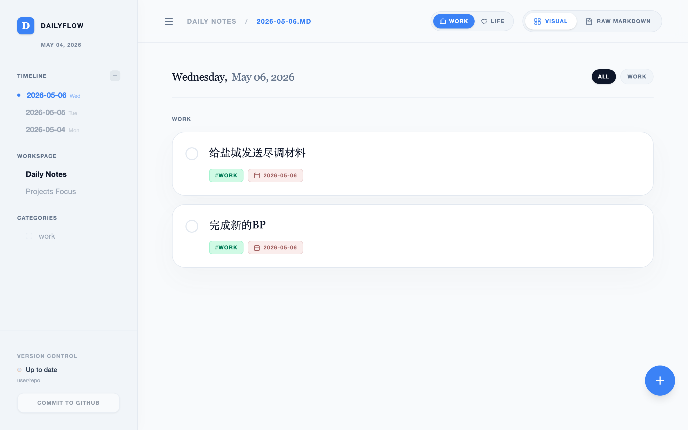

<div align="center">

# DailyFlow
> 让任务自然流动 · Local-first Markdown Task Manager


### 扔进去 → 自动整理 → 任务流动


[核心功能](#-核心功能) • [界面预览](#-界面预览) • [快速开始](#-快速开始) • [架构](#-架构)

__简体中文__ | [English](./README_EN.md)

---
</div>

## 项目简介

DailyFlow 是一款**本地优先**的 Markdown 日程管理软件：用 Markdown 文件作为主数据，用 Web 界面提升操作效率，用自动迁移、项目追踪和 AI 摘要减少每天重复整理任务的负担。

### 为什么选择 DailyFlow？

| 传统方式 | DailyFlow |
|----------|-----------|
| 每天手动复制未完成任务 | 自动迁移，零遗漏 |
| 任务散落在各个文件里 | 项目统一管理，进度清晰 |
| 商业工具锁定数据 | Markdown 文件，完全可控 |
| 多设备同步依赖云服务 | GitHub 同步，完全开源 |

## 核心功能

### 1. 自动任务迁移
未完成的任务自动迁移到明天，保持工作连续性：

- **智能迁移**：只迁移 `- [ ]` 未完成任务，已完成自动保留
- **子任务完整**：缩进的子任务、说明、附件一并迁移
- **跳过标记**：添加 `#no-rollover` 标签的任务不迁移
- **日期调度**：`#scheduled:YYYY-MM-DD` 控制任务出现时间

### 2. 项目追踪
长期项目不再散落在每日日记里：

- 项目卡片展示进度和状态
- 子任务树支持多层级嵌套
- 每日记录推进情况
- 关联附件和参考资料

### 3. GitHub 同步
保持本地优先，同时获得版本历史和多设备同步：

- 自动 commit 形成可读历史
- 手动或自动 push 到 GitHub
- 冲突检测与解决提示
- 支持私有仓库

### 4. AI 智能摘要
用 AI 分析近期任务，生成进度摘要：

- 支持 DeepSeek、Claude、OpenAI 等多 provider
- 7天/30天/全部时间范围
- 自动识别完成率和高优先级任务

### 5. 多 AI Provider 支持
灵活配置你喜欢的 AI 服务：

- **DeepSeek** - 性价比高
- **Anthropic Claude** - 高质量推理
- **OpenAI GPT** - 通用能力强
- **自定义** - 支持任何 OpenAI 兼容 API

## 界面预览

| 今日视图 | 项目视图 | 设置页面 |
|----------|----------|----------|
|  |  |  |

| 工作区设置 |
|------------|
|  |

## 快速开始

### 环境要求

- Node.js 18+
- npm 或 yarn
- Rust（用于 Tauri 桌面应用）
- Git（用于版本同步）

### 安装

```bash
# 克隆项目
git clone https://github.com/frankfika/dailyflow.git
cd dailyflow

# 安装依赖
npm install
```

### 启动方式

**桌面应用（推荐）**

```bash
npm run tauri dev
```

Tauri 会自动启动前端 + 后端，并打开原生桌面窗口。

**浏览器模式**

```bash
npm run dev:all
```

访问 http://localhost:3000

### 配置工作区

1. 首次打开会显示工作区设置
2. 选择你的 Markdown 日记根目录（如 `~/Obsidian/daily/`）
3. 设置 GitHub 同步（可选）
4. 开始使用！

## 架构

```
┌─────────────────────────────────────────────────────────┐
│                      Frontend (React)                     │
│  ┌──────────┐  ┌──────────┐  ┌──────────┐  ┌────────┐ │
│  │ Today    │  │ Projects │  │ Settings │  │ AI     │ │
│  │ View     │  │ View     │  │          │  │ Summary│ │
│  └──────────┘  └──────────┘  └──────────┘  └────────┘ │
└────────────────────────┬────────────────────────────────┘
                         │ REST API
┌────────────────────────┴────────────────────────────────┐
│                    Backend (Express)                      │
│  ┌──────────┐  ┌──────────┐  ┌──────────┐  ┌────────┐ │
│  │ Config   │  │ Parser   │  │ Rollover │  │ Git    │ │
│  │ Service  │  │ Service  │  │ Service  │  │ Service│ │
│  └──────────┘  └──────────┘  └──────────┘  └────────┘ │
└────────────────────────┬────────────────────────────────┘
                         │
┌────────────────────────┴────────────────────────────────┐
│                    Local File System                      │
│  ┌──────────────────────────────────────────────────┐   │
│  │  ~/Obsidian/daily/                               │   │
│  │  ├── 2026-05-01.md                                │   │
│  │  ├── 2026-05-02.md                                │   │
│  │  └── projects/                                    │   │
│  │      └── example.md                               │   │
│  └──────────────────────────────────────────────────┘   │
└─────────────────────────────────────────────────────────┘
```

## 技术栈

| 层级 | 技术 |
|------|------|
| 桌面框架 | Tauri 2 (Rust) |
| 前端框架 | React 19 + TypeScript |
| UI 库 | Tailwind CSS + Lucide Icons |
| 动画 | Motion (Framer Motion) |
| 后端 | Express.js + TypeScript |
| Markdown | react-markdown + Prism |
| 测试 | Vitest + Playwright |

## 更新日志

### v0.2 (2026-05-10)
- ✨ Tauri 桌面应用支持（`npm run tauri dev` 启动原生窗口）
- 🐛 修复任务 ID 不稳定导致删除后其他任务消失的 bug
- 🐛 修复 parser 默认分类 `Tasks` 被错误加入 tag 的 bug
- 🐛 修复 `work`/`life` context tag 出现在分类列表的 bug
- 🐛 修复无 category tag 的任务不显示的 bug
- 🐛 修复添加任务时 deadline 被强制设为今天的 bug
- 🐛 修复归档日期硬编码问题（改为动态 14 天滚动窗口）
- 🐛 修复 config.json 损坏时服务崩溃的 bug

### v0.1 (2026-05-06)
- ✨ GitHub 同步功能
- ✨ AI Provider 多 provider 配置
- ✨ E2E 测试基础设施
- ✨ ContextSwitcher 组件
- 🐛 修复多项 bug 和体验优化

## License

MIT License
