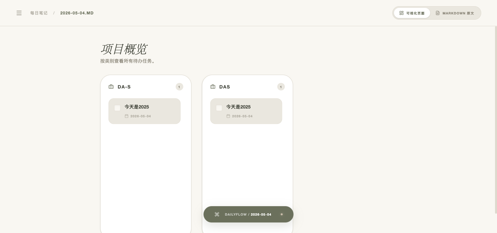
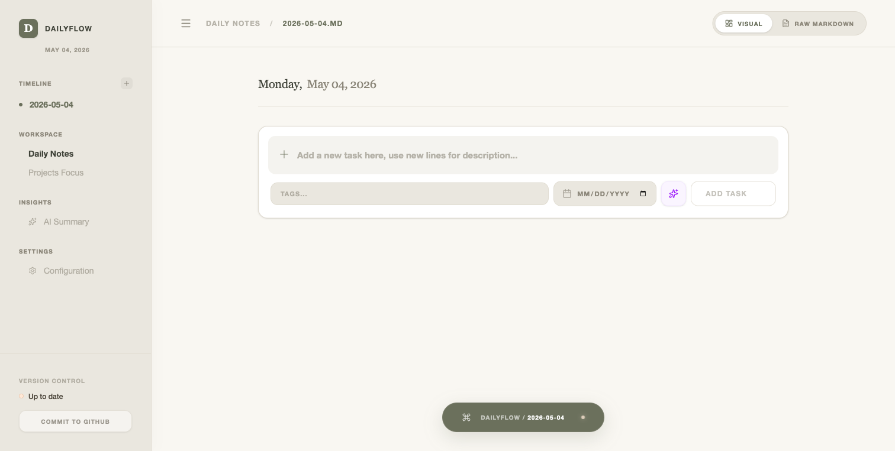

<div align="center">


# DailyFlow

> Local-First Smart Daily Task Manager · 本地优先的智能日程管理系统


### Transform Markdown Notes into Smart Task Workspace


[Features](#-features) • [Screenshots](#-screenshots) • [Quick Start](#-quick-start) • [Tech Stack](#-tech-stack)

[简体中文](./README.md) | __English__

---
</div>

## Introduction

DailyFlow is a **local-first** smart daily task management system designed for users who work with Markdown and Obsidian. It's not just another closed Todo App, but an intelligent workspace that enhances your existing workflow.

### Why Choose DailyFlow?

| Traditional Way | DailyFlow |
|----------------|-----------|
| Manually copy-paste unfinished tasks | Auto-rollover to next day |
| Tasks scattered across files | Unified project management view |
| Plain text editing only | Visual task list + Markdown editor |
| No AI assistance | AI-powered summary and task generation |
| Data locked in apps | Your data, your files (Markdown) |

## ✨ Features

### 1. Smart Task Rollover
Automatically migrate unfinished tasks to the next day without manual copy-paste:

- **Auto Detection**: Scan yesterday's Markdown file and extract unfinished tasks
- **Smart Tagging**: Preserve all task metadata (tags, deadlines, priority)
- **Source Tracking**: Mark task source date for easy tracing



### 2. Project Management
Organize long-term tasks into projects and track progress:

- **Project View**: Dedicated project management interface
- **Status Tracking**: Active, Completed, Archived
- **Task Association**: Project tasks auto-sync to daily view


### 3. AI Smart Assistant
Boost productivity with AI:

- **Smart Summary**: Auto-summarize work achievements over time
- **Task Generation**: Generate structured tasks from natural language
- **Custom Prompts**: Support custom AI prompt templates

### 4. Workspace Configuration
Flexible workspace management:

- **First-Run Wizard**: Guide users to set workspace path
- **Path Validation**: Auto-validate and create workspace directory
- **GitHub Sync**: Configure GitHub repository for data sync

## 📸 Screenshots

| Main Interface | Project Management | Features |
|---------------|-------------------|----------|
|  |  |  |

## 🚀 Quick Start

### Install Dependencies

```bash
git clone https://github.com/frankfika/dailyflow.git
cd dailyflow
npm install
```

### Start Application

```bash
# Start both frontend and backend
npm run dev:all

# Or start separately
npm run dev      # Frontend (http://localhost:3002)
npm run server   # Backend (http://localhost:3003)
```

### First Use

1. Visit http://localhost:3002
2. Follow the wizard to set workspace path (can be Obsidian directory)
3. Start using!

## 🛠️ Tech Stack

```text
Frontend   React 19 + TypeScript + Vite + Tailwind CSS
Backend    Express.js + TypeScript
Storage    Markdown files (local file system)
AI         Google Gemini API
Testing    Vitest + Testing Library
```

## 📁 Project Structure

```text
dailyflow/
├── src/                    # Frontend source code
│   ├── components/         # React components
│   ├── api/               # API client
│   └── types/             # TypeScript type definitions
├── server/                # Backend source code
│   ├── routes/            # API routes
│   ├── services/          # Business logic
│   └── types/             # Type definitions
├── docs/                  # Documentation and assets
└── scripts/               # Utility scripts
```

## 🎯 Core Features

- ✅ **Local-First**: All data stored in local Markdown files
- ✅ **Obsidian Compatible**: Fully compatible with Obsidian Markdown format
- ✅ **Auto Task Rollover**: Unfinished tasks auto-migrate to next day
- ✅ **Project Management**: Dedicated project management view
- ✅ **AI Smart Assistant**: Use AI to generate tasks and summaries
- ✅ **GitHub Sync**: Support GitHub repository sync
- ✅ **Visual Editing**: Visual task list + Markdown editor

## 📝 Changelog

### v1.0.0 (2026-05)
- ✨ Add workspace configuration (first-run wizard, path validation)
- ✨ Implement project management system (full CRUD operations)
- ✨ Add AI summary enhancements (custom date ranges, prompt templates)
- ✨ Add GitHub repository validation
- 🐛 Fix task deletion state sync bug
- 🔧 Update backend port from 3002 to 3003

## 📄 License

MIT License - See [LICENSE](LICENSE) file for details

## 🤝 Contributing

Contributions welcome! Please see [CONTRIBUTING.md](CONTRIBUTING.md) for details.

## 📮 Contact

- GitHub: [@frankfika](https://github.com/frankfika)
- Issues: [GitHub Issues](https://github.com/frankfika/dailyflow/issues)

---

<div align="center">

**[⬆ Back to Top](#dailyflow)**

Made with ❤️ by DailyFlow Team

</div>
