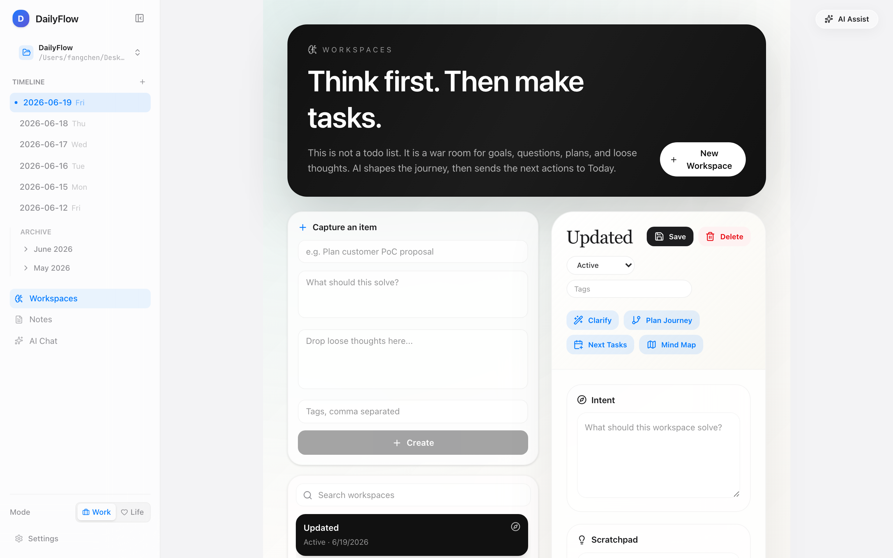
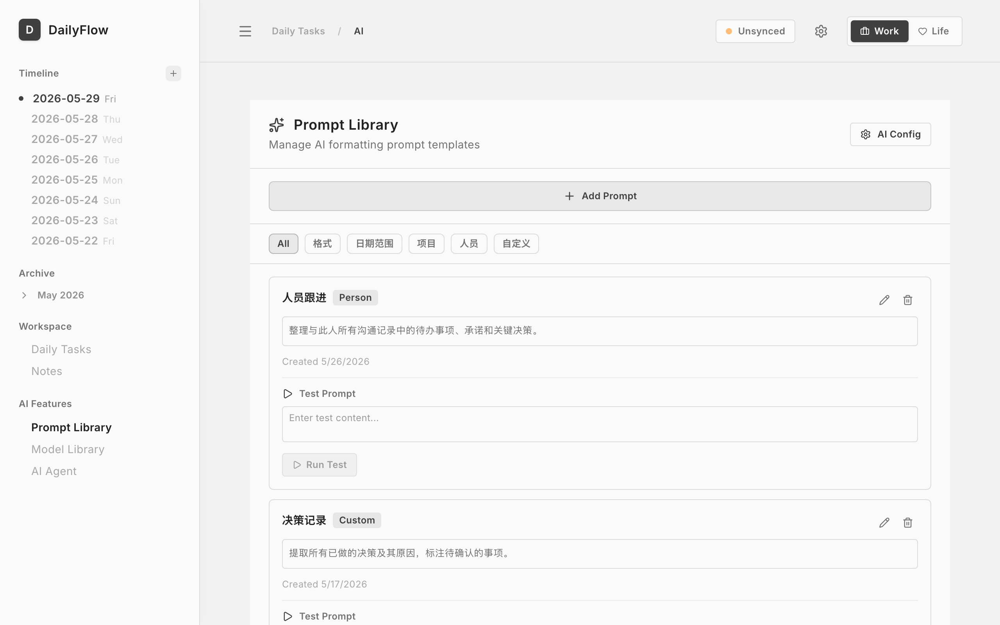

<div align="center">


# DailyFlow

> **Local-first thinking workspaces & task system**
>
> Think first. Then make tasks.


[Features](#-features) · [Screenshots](#-screenshots) · [Quick Start](#-quick-start) · [Tech Stack](#-tech-stack) · [Contributing](#-contributing)

[简体中文](./README.md) | __English__

---

</div>

## 🎉 v1.0.0 Major Release

**Thinking Workspaces are now generally available.** DailyFlow is no longer just a todo list — it's an integrated **thinking + execution** system: capture a goal, question, or scattered thought into a workspace, let AI draft a brief, plan a journey, generate a mind map, and push the next actions straight into Today.

| You want to... | Before | v1.0.0 |
|---------------|--------|--------|
| Tackle a complex project | Squeeze thinking into task titles | Dedicated **Thinking Workspace**, lasting weeks |
| Organize your thoughts | Hand-write briefs and roadmaps | One-click **AI Brief / Journey** |
| Break down a goal | Manually split into tasks | **AI Next Tasks**, preview then push |
| Track progress | Just checkboxes | **Timeline** auto-logs every step |

---

## 📖 Introduction

DailyFlow is a **local-first** intelligent task and thinking management desktop app. Markdown files are the single source of truth, a built-in AI assistant supports **15+ model providers**, and unfinished tasks automatically roll over to the next day. **v1.0.0** introduces Thinking Workspaces — bridging "thinking it through" and "getting it done."

### Why DailyFlow?

| Traditional | DailyFlow |
|-------------|-----------|
| Manually carry over unfinished tasks every day | Auto-migration, ready when you open |
| Data locked in SaaS platforms | Local Markdown files, full ownership |
| Requires internet and Node.js installed | Offline-first, **bundled Node.js runtime** |
| Complex project tools are hard to learn | Minimal design, focused on today |
| AI features cost extra | Built-in AI, 15+ providers |
| Big goals have nowhere to live | **Thinking Workspaces** own goals & roadmaps |

---

## ✨ Features

### 🧠 Thinking Workspaces (new in v1.0.0)

A workspace is a **first-class object** in DailyFlow — it can be a big goal, a fuzzy idea, a project phase, or a meeting topic. Tasks are just the smallest actions it produces.

- **Multiple creation paths**: from a goal, question, note, task, or `Cmd+K` capture
- **AI Clarify (Brief)**: auto-generates structured brief from scratchpad (goal, context, success criteria, constraints, missing info)
- **AI Plan Journey**: generates phases, milestones, risks, this week focus, and today's smallest action
- **AI Mind Map**: Mermaid format covering goals, inputs, risks, resources, decisions, and next actions
- **AI Next Tasks**: 3-7 tiny tasks (15-60 min each) generated from journey, preview then push to Today
- **Timeline tracking**: every AI output, task completion, and decision leaves a trace
- **Status management**: `active` / `paused` / `completed` / `archived`
- **Crypto-random IDs**: server ignores client-supplied IDs, uses `tw_` prefix + crypto random suffix to prevent ID takeover
- **Graceful degradation**: one corrupted workspace file won't break the whole list



### 📋 Task Management

- **Auto Migration**: unfinished tasks auto-roll to next day with source date tracking
- **Card-based UI**: tasks grouped by tags, with comments, linked notes, and linked workspaces
- **Work/Life Switch**: one-click context switching, tasks auto-filtered
- **Project Overview**: cross-date aggregation by category
- **Tag System**: `#tag`, `#deadline:date`, `#priority:level`, `#project:name`, `#workspace:tw_xxx`

### 🤖 AI Assistant

- **AI Chat**: full chat interface with multi-session, context injection (today's tasks/notes/projects/workspace)
- **AI Tool Use**: AI can directly create tasks, save notes, and operate workspaces
- **Brain Dump**: pour in scattered thoughts, AI extracts and categorizes
- **AI Summary**: generate structured daily/weekly reports
- **Skill Marketplace**: slash commands and Agent Skills
- **Prompt Library**: manage and test AI prompt templates


### 🔌 AI Model Support

One-click configuration for 15+ AI providers:

| Type | Providers |
|------|-----------|
| Aggregator | **B.AI** (29+ models, one key), OpenRouter |
| China | DeepSeek, Kimi, MiniMax, GLM, Doubao, Qwen, SiliconFlow |
| Global | Anthropic Claude, OpenAI, Google Gemini, Groq |
| Custom | Any OpenAI-compatible API |

### 📝 Notes

- **Multi-type**: regular notes, meeting notes, AI summaries
- **Read-only Preview**: click a card for read-only view, hit Edit to modify — no accidental edits
- **AI Assist**: polish, continue, extract todos, format meeting notes
- **Send to Chat**: bind a note as context in AI chat
- **@Mentions**: auto-parsed, filterable by person
- **Task Linking**: bidirectional linking; notes can also spawn workspaces


### 📚 Multi-notebook / Workspaces

- Sidebar switcher for multiple Markdown folders
- Auto-discovers local note folders
- Each workspace remembers last visited date
- Workspaces, notes, and tasks share the same file tree

### 🔄 Sync & Backup

- **Git Sync**: one-click push to GitHub, status shown in sidebar
- **IPFS Backup**: decentralized backup via Pinata with permanent CID
- **In-app Updates**: auto-detect new versions, one-click install

---

## 📸 Screenshots

| Today (home) | Thinking Workspaces (new v1.0.0) |
|:---:|:---:|
|  |  |

| AI Chat | Notes |
|:---:|:---:|
|  |  |

| Projects | Prompt Library |
|:---:|:---:|
|  |  |

---

## 🚀 Quick Start

### 📦 Download (Recommended)

Grab the installer from [Releases](https://github.com/frankfika/dailyflow/releases/latest):

| Platform | File | Size |
|----------|------|------|
| macOS (Apple Silicon) | `DailyFlow_x.x.x_aarch64.dmg` | ~33 MB |
| macOS (Intel) | `DailyFlow_x.x.x_x64.dmg` | ~35 MB |
| Windows | `DailyFlow_x.x.x_x64-setup.exe` | ~30 MB |
| Linux | `DailyFlow_x.x.x_amd64.AppImage` | ~34 MB |

> **macOS users**: If you see "damaged" / "cannot be opened":
> ```bash
> sudo xattr -rd com.apple.quarantine /Applications/DailyFlow.app
> ```
>
> **Truly self-contained**: v1.0.0 dmg bundles the Node.js runtime — **no system Node required**, just download and run.

### Run from Source

Requirements: **Node.js ≥ 20** (only needed for development, not at runtime)

```bash
git clone https://github.com/frankfika/dailyflow.git
cd dailyflow
npm install

# Dev mode (frontend + backend)
npm run dev:all

# Or run as a desktop app
npm run tauri dev

# Full build (including Tauri desktop app)
npm run build
npm run build:server
npm run tauri build
```

### First Use

1. Launch the app and set your **workspace directory** (where Markdown files will be stored)
2. App auto-creates today's journal file
3. Click **Workspaces** in the sidebar and create your first workspace with one sentence
4. Inside the workspace, hit **Clarify** → AI drafts a Brief; hit **Plan Journey** for a roadmap
5. Hit **Next Tasks** → AI generates next actions, preview, then push to Today

---

## 🏗 Architecture

```
┌──────────────────────────────────────────────────────────────┐
│                  Tauri Desktop Shell                          │
│           (Bundled Node.js runtime, zero external deps)      │
├──────────────────────────────────────────────────────────────┤
│  ┌────────────────┐         ┌─────────────────────────────┐  │
│  │   React UI     │◀───────▶│   Express Backend (3003)     │  │
│  │ (Vite/TS/TSX)  │  HTTP   │   (Bundled Node + Server)    │  │
│  └────────────────┘         └────────────┬────────────────┘  │
│                                          │                    │
│                       ┌──────────────────┼──────────────────┐│
│                       │                  │                  │ │
│                  ┌────▼────┐       ┌─────▼─────┐      ┌─────▼────┐
│                  │  Today  │       │Workspaces │      │  Notes   │
│                  │  Tasks  │       │  (v1.0.0) │      │          │
│                  └────┬────┘       └─────┬─────┘      └─────┬────┘
│                       │                  │                  │ │
│                       └──────────────────┼──────────────────┘│
│                                          │                    │
│                          ┌───────────────▼────────────────┐  │
│                          │    Markdown Files (Source of    │  │
│                          │   Truth: Daily/, Workspaces/,   │  │
│                          │   Notes/, Projects/)            │  │
│                          └───────────────┬────────────────┘  │
│                                          │                    │
│              ┌───────────────────────────┼───────────────────┐│
│              ▼                           ▼                   ▼│
│      ┌──────────────┐            ┌────────────┐        ┌────────┐│
│      │ Git (GitHub) │            │ IPFS/Pinata│        │ AI API ││
│      └──────────────┘            └────────────┘        └────────┘│
└──────────────────────────────────────────────────────────────────┘
```

### Key Architectural Changes in v1.0.0

- **Bundled Node.js runtime**: Tauri downloads and embeds the matching Node binary at build time — users don't need Node installed
- **Thinking Workspaces as first-class objects**: stored under `Workspaces/`, parallel to `Tasks/`
- **Crypto-random IDs**: all workspace IDs are server-generated via `crypto.randomBytes`; client-supplied IDs are never trusted
- **Rust launcher hardened**: `src-tauri/src/server.rs` auto-locates the bundled runtime, sets executable permissions, and provides multiple fallback paths for dev and prod

---

## 🛠 Tech Stack

| Layer | Technology |
|-------|------------|
| Frontend | React 19 + TypeScript + Tailwind CSS 4 + Motion (Framer Motion) |
| Build | Vite 6 + esbuild |
| Backend | Express.js (TypeScript) |
| Desktop | Tauri 2 (Rust) |
| Runtime | **Bundled Node.js 20+** (auto-downloaded with permission handling) |
| Data | Markdown files + YAML frontmatter (single source of truth) |
| AI | 15+ providers (B.AI / Claude / GPT / Gemini / DeepSeek / Kimi / GLM / Qwen etc.) |
| Sync | Git + GitHub API |
| Backup | IPFS + Pinata |
| Tests | Vitest + Testing Library (**149 tests, all passing**) |

---

## 🤝 Contributing

Contributions are welcome — code, bug reports, and feature ideas.

### Local Development

```bash
git clone https://github.com/frankfika/dailyflow.git
cd dailyflow
npm install
npm run dev:all
```

### Code Standards

- TypeScript strict mode, all PRs must pass `npm run lint`
- Test coverage: new features require tests; run `npm test` to confirm green
- Component naming: PascalCase; utility functions: camelCase; types: PascalCase
- Commit messages: follow Conventional Commits (`feat:` / `fix:` / `chore:` / `docs:` / `test:`)

### Pull Request Flow

1. Fork the repo and branch from `main`: `git checkout -b feat/your-feature`
2. Commit your changes: `git commit -m "feat: add your feature"`
3. Push: `git push origin feat/your-feature`
4. Open a Pull Request on GitHub describing the change and tests

### Bug Reports

Use [GitHub Issues](https://github.com/frankfika/dailyflow/issues) and include:

- Reproduction steps
- Expected vs actual behavior
- System info (macOS / Windows / Linux version)
- App version (Settings → About)

---

## 📜 Changelog

### v1.0.0 (2026-06)

**🎉 Major milestone: Thinking Workspaces GA**

#### ✨ Features

- 🧠 **Thinking Workspaces**: first-class object for goals / ideas / projects, peer to tasks
- 🤖 **AI Clarify (Brief)**: structured summary auto-generated from scratchpad
- 🛤️ **AI Plan Journey**: phases, milestones, risks, this week, today's smallest action
- 🗺️ **AI Mind Map**: Mermaid format covering goals, inputs, risks, resources, decisions, next actions
- ✅ **AI Next Tasks**: 3-7 tiny 15-60 min tasks, preview then push to Today
- 📅 **Timeline tracking**: auto-logs every AI output, task completion, decision
- 🔖 **Multi-entry creation**: from Today, note, project, or `Cmd+K`

#### 🔒 Security

- **Crypto-random IDs**: server ignores client IDs, uses `tw_` prefix + crypto random suffix — prevents ID takeover attacks
- **Graceful error handling**: one corrupted workspace file won't break the whole list
- **Stronger path validation**: blocks `../` and similar traversal patterns

#### 📦 Infrastructure

- **Bundled Node.js runtime**: Tauri dmg ships a 91 MB Node binary — **no system Node required**
- **Hardened Rust launcher**: auto-locates runtime, handles executable permissions, multiple fallback paths
- **Bundle script**: `scripts/bundle-node.mjs` auto-downloads and packages Node runtime

#### 🧪 Tests

- 6 new test files covering full workspace lifecycle
- 149 tests all passing; TypeScript strict mode, 0 errors

### Earlier Versions

See the [full changelog](https://github.com/frankfika/dailyflow/releases).

---

## 📄 License

[Apache License 2.0](./LICENSE)

---

## 🙏 Acknowledgments

Thanks to all contributors and users for their feedback. DailyFlow started as a small wish — "I don't want to manually organize my todos every day" — and has grown into a complete thinking + execution system.

<div align="center">

If this project helps you, a ⭐ would be appreciated!

[⭐ Star on GitHub](https://github.com/frankfika/dailyflow) · [📥 Download v1.0.0](https://github.com/frankfika/dailyflow/releases/latest) · [🐛 Report a Bug](https://github.com/frankfika/dailyflow/issues)

</div>