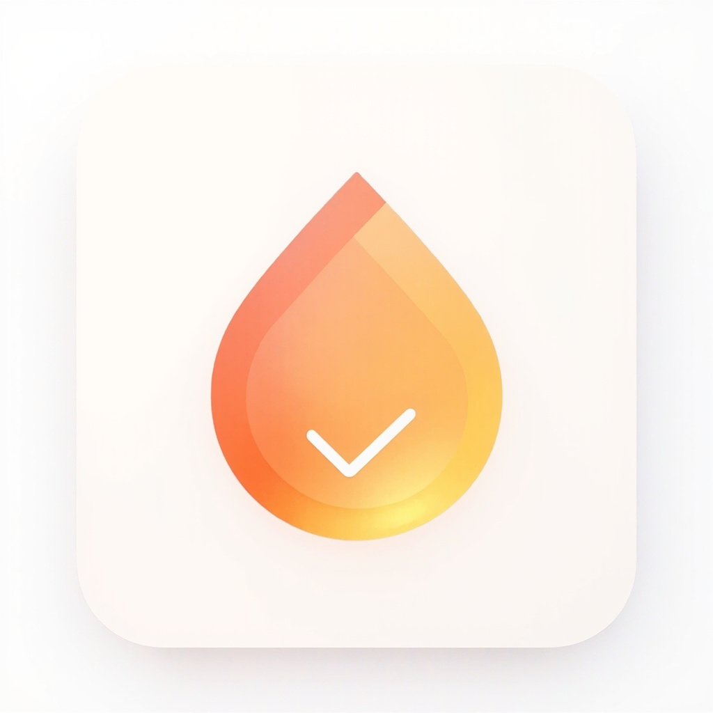
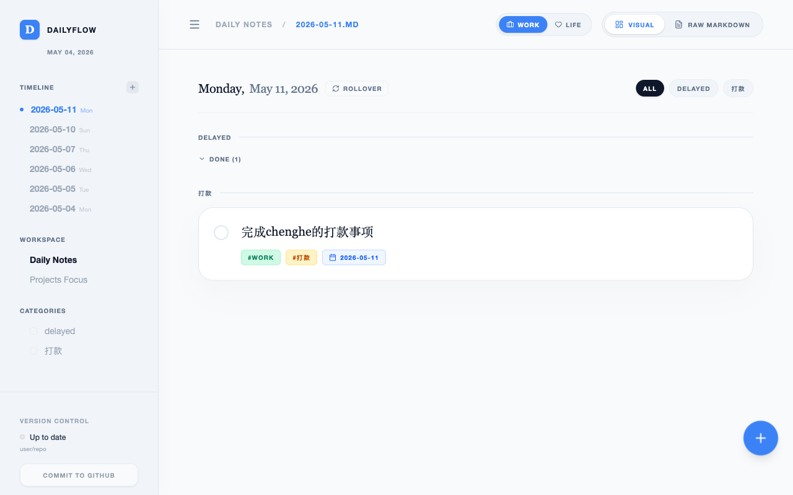
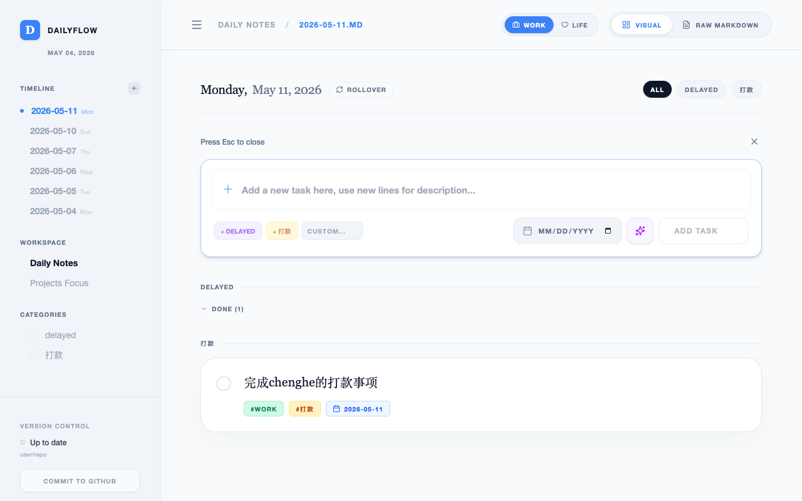
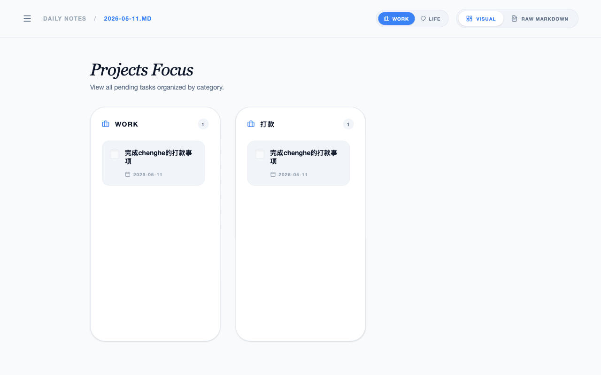
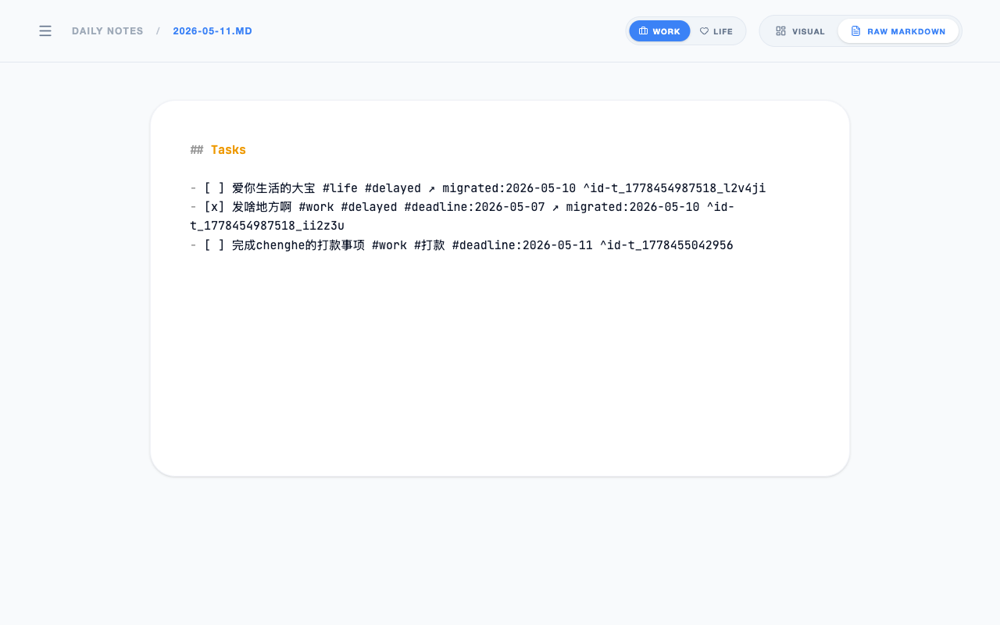

<div align="center">



# DailyFlow

> Local-First Daily Task Management · 本地优先的每日任务管理工具



### Markdown-powered. Auto-migrates unfinished tasks. Stay focused on today.


[Features](#-features) • [Screenshots](#-screenshots) • [Quick Start](#-quick-start) • [Architecture](#-architecture)

[简体中文](./README.md) | __English__

---
</div>

## Introduction

DailyFlow is a **local-first** daily task management desktop app. It uses Markdown files as its data source and automatically handles cross-day task migration, so you never have to manually carry over yesterday's unfinished items.

### Why DailyFlow?

| Traditional Way | DailyFlow |
|----------------|-----------|
| Manually copy unfinished tasks every morning | Auto-migration on app open |
| Task data locked in a SaaS platform | Local Markdown files, fully portable |
| Requires internet to function | Offline-first, always available |
| Complex project management UI | Minimal design, focused on today |
| Incompatible with Obsidian/other editors | Native Markdown, works everywhere |

## ✨ Features

### 1. Automatic Task Rollover

Unfinished tasks automatically migrate to today when you open the app, with source date tracking. Manual preview and confirmation also supported.

- **Auto-migrate**: Detects and migrates on app launch
- **Manual rollover**: Preview tasks before confirming migration
- **Source tracking**: Each migrated task shows its original date

### 2. Visual + Markdown Dual Mode

Switch freely between a polished visual interface and raw Markdown editing. Data is always stored as Markdown — open it with any editor.

### 3. AI Brain Dump

Dump scattered thoughts in one go. AI extracts tasks, categorizes them, and sets deadlines. Supports DeepSeek, OpenAI, Anthropic, and custom providers.

### 4. Work/Life Context Switching

Toggle between Work and Life modes with one click. Tasks filter automatically by context.

### 5. Projects Overview

Aggregate all pending tasks across dates, organized by category and project for a bird's-eye view.

### 6. Git Sync

One-click commit to GitHub. Automatic backup for all your notes and task data.

## 📸 Screenshots

| Main Interface | Add Task |
|---------------|----------|
|  |  |

| Projects Overview | Markdown Editor |
|------------------|-----------------|
|  |  |

## 🚀 Quick Start

### Option 1: Download from Releases (Recommended)

Go to [Releases](https://github.com/frankfika/dailyflow/releases) and download for your platform:

| Platform | File |
|----------|------|
| macOS (Apple Silicon) | `DailyFlow_x.x.x_aarch64.dmg` |
| macOS (Intel) | `DailyFlow_x.x.x_x64.dmg` |
| Windows | `DailyFlow_x.x.x_x64-setup.exe` |
| Linux | `DailyFlow_x.x.x_amd64.AppImage` |

### Option 2: Run from Source

```bash
# Clone the repo
git clone https://github.com/frankfika/dailyflow.git
cd dailyflow

# Install dependencies
npm install

# Start dev servers (frontend + backend)
npm run dev      # Vite dev server (frontend)
npm run server   # Express server on port 3003

# Or launch the Tauri desktop app
npm run tauri dev
```

### First Use

1. On first launch, set your workspace directory (where Markdown files are stored)
2. The app creates today's daily note automatically
3. Start adding tasks with tags for categorization
4. Next day, unfinished tasks auto-migrate to today

## 🏗 Architecture

```
┌─────────────────────────────────────────────┐
│              Tauri Desktop Shell             │
├─────────────────────────────────────────────┤
│                                             │
│  ┌─────────────┐     ┌──────────────────┐  │
│  │   React UI  │────▶│  Express Backend  │  │
│  │  (Vite/TS)  │◀────│   (Port 3003)    │  │
│  └─────────────┘     └──────────────────┘  │
│                              │               │
│                              ▼               │
│                    ┌──────────────────┐      │
│                    │  Markdown Files  │      │
│                    │  (Source of Truth)│      │
│                    └──────────────────┘      │
│                              │               │
│                              ▼               │
│                    ┌──────────────────┐      │
│                    │   Git (Optional) │      │
│                    │   GitHub Sync    │      │
│                    └──────────────────┘      │
│                                             │
└─────────────────────────────────────────────┘
```

**Core Principles:**
- **Markdown is truth**: All data stored as Markdown files, the single source of truth
- **Local-first**: All operations happen locally, no network required
- **Non-destructive**: All write operations have preview and confirmation
- **Git-friendly**: Every action can generate a meaningful commit

## 🛠 Tech Stack

| Layer | Technology |
|-------|-----------|
| Frontend | React 19 + TypeScript + Tailwind CSS 4 |
| Animation | Framer Motion |
| Build | Vite 6 |
| Backend | Express.js (TypeScript) |
| Desktop | Tauri 2 (Rust) |
| AI | DeepSeek / OpenAI / Anthropic (optional) |
| Version Control | Git + GitHub API |

## 📝 Data Format

DailyFlow uses standard Markdown to store tasks:

```markdown
## Tasks

- [ ] Finish project report #work #deadline:2026-05-15
- [x] Reply to client email #work
- [>] Organize meeting notes #work (migrated to 2026-05-12)

## Notes

Today's meeting discussed Q3 plans...
```

**Task Status:**
- `- [ ]` Todo
- `- [x]` Done
- `- [>]` Migrated

**Supported Tags:**
- `#tag` — Category tag
- `#deadline:YYYY-MM-DD` — Due date
- `#priority:high|medium|low` — Priority level
- `#project:name` — Project association

## 📄 License

[Apache License 2.0](./LICENSE)
