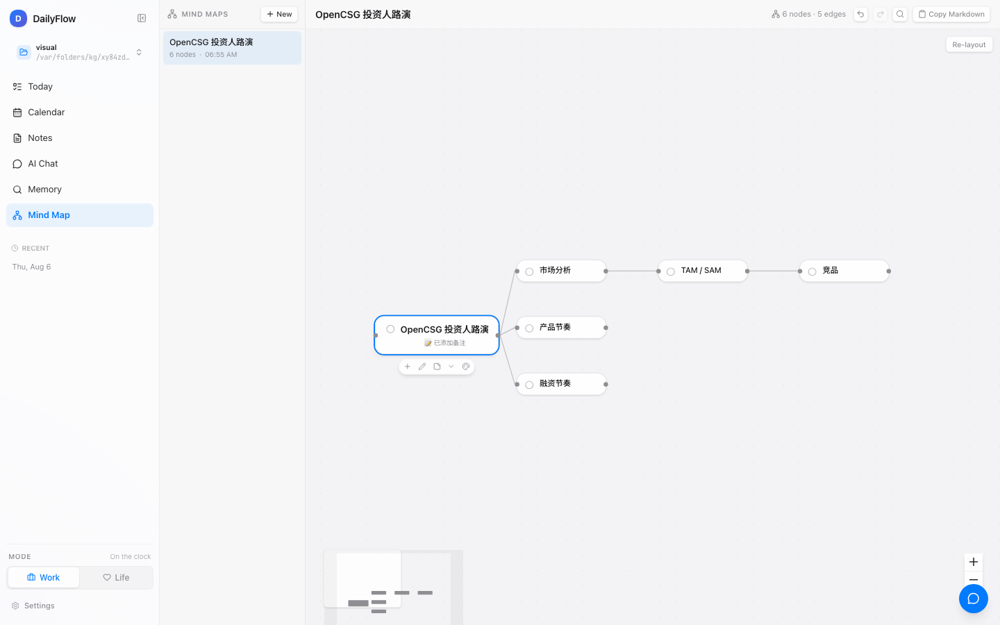
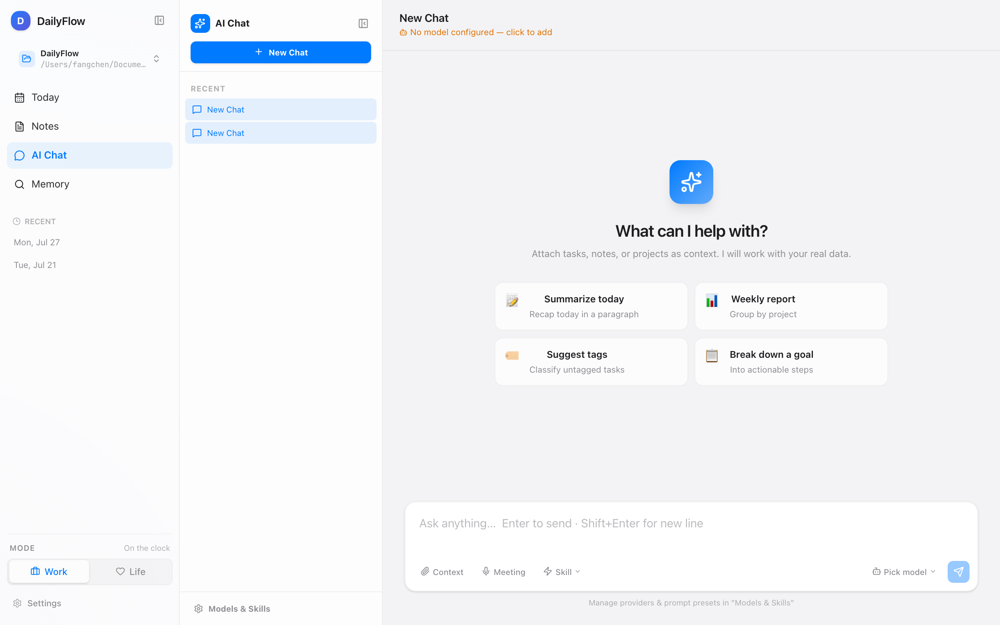
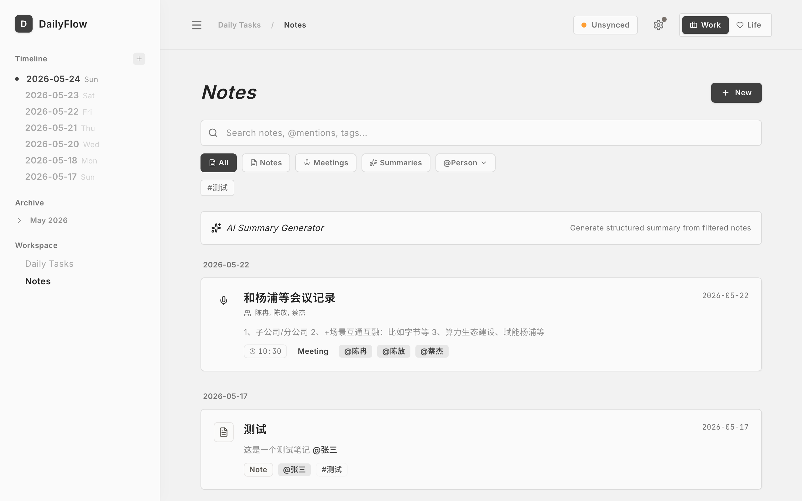
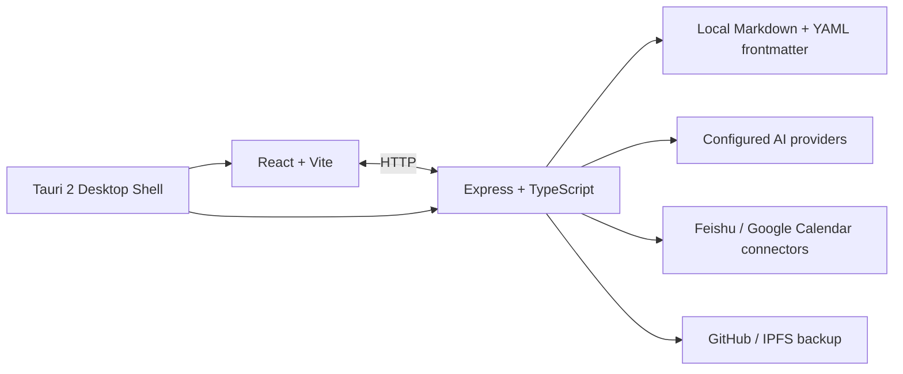

<div align="center">


# DailyFlow

> **Turn an endless backlog into the work that matters today**
>
> A local-first workspace for tasks, notes, calendars, and AI-assisted work.


[Features](#-features) · [Screenshots](#-screenshots) · [Quick Start](#-quick-start) · [Development](#-development) · [Docs](#-docs)

[简体中文](./README.md) | __English__

</div>

## What is DailyFlow?

DailyFlow is for people pulled in too many directions by backlogs, meetings, and loose ideas. It brings capture, planning, execution, and review into one desktop workspace while keeping Markdown files in a local folder you control.

Its workflow is deliberately small:

1. **Capture** tasks, ideas, and meeting inputs in Inbox or Notes.
2. **Focus** on what to move today, including waiting and leftover work.
3. **Review** confirmed context in Memory and Review.

DailyFlow is a good fit if you want AI assistance and calendar connections without locking your working data inside a single SaaS platform.

## 🆕 Sprint 1 shipped (roadshow 4-week sprint complete)

> 2026-08-20 merged into main · 9 new commits · 645 tests pass / 0 TS errors

| Tier | Feature | Deck slide |
|---|---|---|
| **P0** | Mind-map node types: 7 (task / question / resource / risk / branch / tag / root) | Slide 04 |
| **P0** | AI organize mind-map: by_topic / by_priority / by_time | Slide 04 |
| **P0** | Proactive proposals: 5-day-overdue tasks surface to Today | Slide 06 |
| **P0** | Memory 3-tier search: structured > metadata > full-text | Slide 06 |
| **P0** | Local Whisper backend toggle (whisper.cpp) | Slide 05 |
| **P1** | Daily report + reflection (`Journal/YYYY-MM-DD.md`) | Slide 03 |
| **P1** | Task completion mirrored back to mind-map node | Slide 04 |
| **P2** | Vector index (TF-IDF in-memory, lancedb-ready) | Slide 12 |
| **P2** | Skill marketplace MVP (GitHub registry + SHA-256) | Slide 12 |
| **P2** | Privacy panel (5 outbound categories listed) | Slide 05 |

Design docs: [`docs/ROADSHOW_VS_PRODUCT_GAP.md`](./docs/ROADSHOW_VS_PRODUCT_GAP.md) · [`CHANGELOG.md`](./CHANGELOG.md)

## ✨ Features

### Today: start with a clear working surface

- See today’s tasks, overdue items, completed count, and focus progress together.
- Choose priorities manually or ask AI to propose a plan based on time, energy, and constraints.
- Review or roll over unfinished work; waiting items are kept out of the active plan.
- Switch between Work and Life contexts so different kinds of work stay separate.

### Inbox and AI workflow

- Quickly capture unprocessed tasks, information, and ideas.
- Extract tasks, notes, and next actions from natural-language input.
- Review AI changes as proposals before they are written to local data.
- Use multi-session AI Chat, context attachments, Prompt Library, and Agent Skill / Slash Command support.

### Notes: document-first knowledge capture

- Manage regular notes, daily notes, meeting records, and AI summaries together.
- Use a list + editor split layout or an optional focus mode.
- Link notes to tasks, filter by people, and attach notes as AI Chat context.
- Keep notes as readable, portable Markdown files.


### Mind Map: break complex problems into branches

- **🆕 7 node kinds**: `task` / `question` / `resource` / `risk` / `branch` / `tag` / `root`, each with its own icon and accent color.
- **🆕 AI Organize**: toolbar `AI Organize` button offers three deterministic strategies — by_topic (group by kind) / by_priority (group by status) / by_time (group by date-like tags). The result is a reviewable proposal card; nothing is written until the user accepts.
- A new `Mind Map` tab with a per-workspace list of maps and an independent pan/zoom canvas (powered by `@xyflow/react`).
- Auto-laid-out horizontal tree. Drag to reposition, `Tab` to add a child, `Enter` to add a sibling, `Backspace` to delete, double-click or `F2` to edit, color-cycle button for 6 named tokens.
- Subtree collapse/expand, inline note editor, Markdown export, undo/redo (50-step history), in-canvas `Ctrl/Cmd+F` search.
- Every node has a three-state `todo` / `in-progress` / `done` status; the header shows a live progress badge.
- **🆕 Task mirror**: completing a task back-writes to its linked node (`status: done` + `## 完成 · YYYY-MM-DD` block). The reasoning stays in place forever.
- 5 starter templates (SWOT, 5W1H, Decision Tree, Task Breakdown, Risk Review) and JSON import/export.
- Auto-save to `<workspaceRoot>/.dailyflow/mindmaps/<id>.json` (600ms debounce).



### Events: break a project into next actions

- Left outline + right canvas dual pane; the project and its actions stay in view together.
- Outline: single-click to edit, `Enter` sibling, `Tab` child, `↑↓` move, `Backspace` delete empty node.
- Canvas nodes have persistent `+` buttons; the whole canvas pans/zooms/scrolls freely and node positions persist.
- A node becomes a task through "Add to Task" with a date picker (today / tomorrow / +3d / next week / custom); scheduling only happens on confirm.
- **🆕 AI Push forward (Event Operator)**: the `AI` button first previews the Event, Evidence, and Commitment scope that will be sent, then runs a bundled DeepSeek Harness sidecar after confirmation. Runs expose live stages, cancellation, reconnect, and recovery. Candidate nodes, edges, Commitments, Decisions, and Outcomes can be reviewed individually on the canvas and are applied atomically only after approval. **Formal data receives zero writes before confirmation**; revision conflicts, duplicate submissions, and partial failures are guarded. The model sees exactly seven DailyFlow allowlisted tools—never Shell, filesystem writes, Terminal, or arbitrary MCP. See the [DeepSeek Harness implementation plan](./docs/DAILYFLOW_2_2_DEEPSEEK_HARNESS_IMPLEMENTATION_PLAN.md).

### Topic Spaces: semantic grouping across the workspace

- A new `Topic Space` dimension that ties every artifact of a project, initiative, or long-running goal together.
- Each space owns one main mind map (default view); Work / Life contexts stay isolated.
- Right-click on a node: Promote (turn a branch into a real Task) / Link to an existing Task / Set as Tag / Unclassify.
- Tasks can be bound to a space; the list view filters by space, then by tag, and TaskCard shows the binding visibly.
- The `^space:<id>` system marker in the Markdown file is the only source of truth for bindings — backups and migrations stay portable.
- A broken-link diagnostic + repair endpoint catches and clears dangling nodes that point at deleted tasks.

### Calendar: tasks and events on one timeline

- Browse day, week, and month views.
- Combine local tasks, timed notes, and external calendar events.
- Authorize, view, sync, and create events in Feishu Calendar.
- The Google Calendar connector is implemented, but needs a production OAuth Client ID before it is ready for out-of-the-box use.

### Memory and Review: preserve useful context

- Memory aggregates confirmed Commitments, projects, meetings, people, decisions, and outcomes.
- Review surfaces weekly summaries, open work, and stale Commitments.
- The v2 data model stores entities separately and includes audit plus import/export support.

### Sync, backup, and desktop runtime

- Sync local workspaces with Git / GitHub.
- Back up through Pinata IPFS and receive a traceable CID.
- Tauri desktop installers bundle Node.js and the Feishu CLI runtime; end users do not need Node, npm, or Homebrew installed.
- macOS, Windows, and Linux installers support in-app updates.

## 🤖 AI models

Configure an AI provider in Settings. The current code covers B.AI, OpenRouter, OpenAI, Anthropic, Google Gemini, DeepSeek, Kimi, MiniMax, GLM, Doubao, Qwen, SiliconFlow, Groq, and other OpenAI-compatible APIs. Actual models depend on the provider configuration.



> AI features require your own API key. DailyFlow does not host your model credentials and does not upload your local Markdown workspace to a DailyFlow service.

## 📸 Screenshots

| Today | AI Chat |
|:---:|:---:|
|  |  |

| Notes | Settings |
|:---:|:---:|
|  |  |

These images are captured from the real local application. Run `node scripts/capture-screenshots.mjs` to refresh them after UI changes.

## 🚀 Quick Start

### Download the desktop app

Download the appropriate installer from the [latest Release](https://github.com/frankfika/dailyflow/releases/latest). Desktop installers bundle the Node.js runtime needed by the local server; on first launch, choose a Markdown workspace directory.

| Platform | Typical installer |
|:---|:---|
| macOS Apple Silicon | `DailyFlow_*_aarch64.dmg` |
| macOS Intel | `DailyFlow_*_x64.dmg` |
| Windows | `DailyFlow_*_x64-setup.exe` |
| Linux | `DailyFlow_*_amd64.AppImage` |

If macOS reports that the app is damaged, follow [MACOS_DAMAGED_FIX.md](./docs/MACOS_DAMAGED_FIX.md).

### Run from source

Development requires Node.js 20+.

```bash
git clone https://github.com/frankfika/dailyflow.git
cd dailyflow
npm install

# Frontend + local Express server
npm run dev:all

# Or run as a Tauri desktop app
npm run tauri dev
```

Open <http://localhost:47831>, then follow the workspace setup flow. Build a production desktop bundle with:

```bash
npm run build
npm run build:server
npm run tauri build
```

## 🧭 Development

```bash
npm run lint          # TypeScript type-check
npm test              # Vitest unit and service tests
npm run test:coverage # Coverage report
npm run build         # Vite production build
```

Repository layout:

```text
src/                  React + TypeScript frontend
server/               Express API, v2 domain, and Markdown repository
src-tauri/            Tauri 2 desktop shell and bundled runtime
scripts/              Build, bundling, screenshot, and acceptance scripts
e2e/                  Playwright end-to-end tests
docs/                 Product, architecture, data, and release docs
```

## 🏗 Architecture



## 📚 Docs

- [AI-native product development spec](./docs/AI_NATIVE_PRODUCT_DEVELOPMENT_SPEC.md)
- [Architecture](./docs/ARCHITECTURE.md)
- [Data format](./docs/DATA_FORMAT.md)
- [Calendar and Feishu sync](./docs/MAIL_WORKSPACE_PLAN.md)
- [Release process](./docs/RELEASE_PROCESS.md)
- [Full changelog](./CHANGELOG.md)

## 🤝 Contributing

Issues, product feedback, and pull requests are welcome. Before submitting, run `npm run lint`, `npm test`, and the relevant build. Use Conventional Commits such as `feat:`, `fix:`, `docs:`, and `test:`.

## 📄 License

Apache License 2.0. Source files and release configuration use the Apache-2.0 SPDX identifier; when adding dependencies, please note their license compatibility in the pull request.

<div align="center">

[⭐ Star on GitHub](https://github.com/frankfika/dailyflow) · [📥 Download latest](https://github.com/frankfika/dailyflow/releases/latest) · [🐛 Report an issue](https://github.com/frankfika/dailyflow/issues)

</div>
