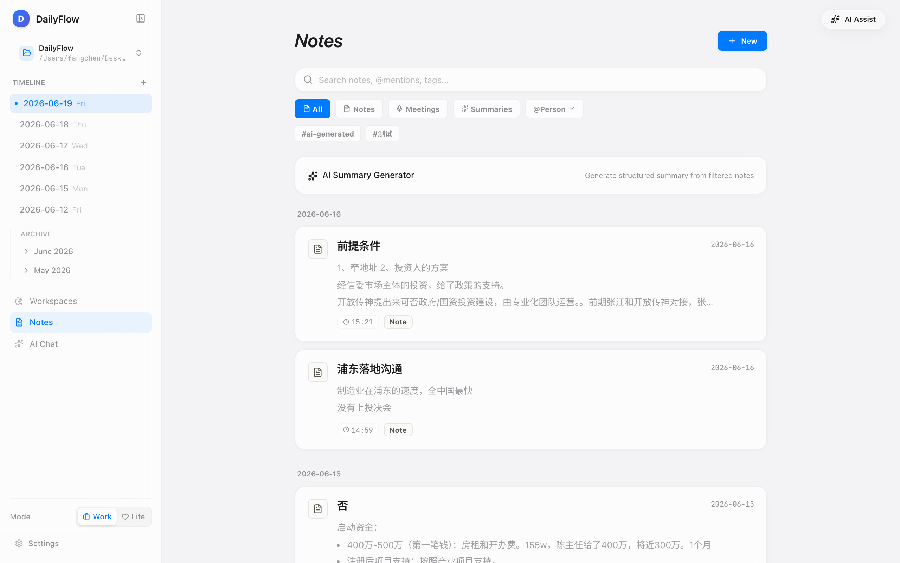

<div align="center">


# DailyFlow

> Local-First Daily Task Management · 本地优先的每日任务管理工具


### Markdown-powered. Auto-migrates unfinished tasks. Stay focused on today.


[Features](#-features) • [Download](#-download) • [Screenshots](#-screenshots) • [Quick Start](#-quick-start) • [Architecture](#-architecture)

[简体中文](./README.md) | __English__

---
</div>

## Introduction

DailyFlow is a **local-first** daily task management desktop app. It uses Markdown files as its data source and automatically handles cross-day task migration, so you never have to manually carry over yesterday's unfinished items.

### Why DailyFlow?

| Traditional Way | DailyFlow |
|----------------|-----------|
| Manually copy unfinished tasks every morning | Auto-migration on app open |
| Task data locked in a SaaS platform | Local Markdown files, fully portable |
| Requires internet to function | Offline-first, always available |
| Complex project management UI | Minimal design, focused on today |
| Incompatible with Obsidian/other editors | Native Markdown, works everywhere |

## 📦 Download

Grab the installer for your platform from [Releases](https://github.com/frankfika/dailyflow/releases/latest):

| Platform | File |
|----------|------|
| macOS (Apple Silicon) | `DailyFlow_x.x.x_aarch64.dmg` |
| Windows | `DailyFlow_x.x.x_x64-setup.exe` |
| Linux | `DailyFlow_x.x.x_amd64.AppImage` |

> **macOS Users**:
> 
> If you see "DailyFlow is damaged" error, run:
> ```bash
> sudo xattr -rd com.apple.quarantine /Applications/DailyFlow.app
> ```
> See [macOS Fix Guide](docs/MACOS_DAMAGED_FIX.md) for details.

## ✨ Features

### 1. Automatic Task Rollover

Unfinished tasks automatically migrate to today when you open the app, with source date tracking. Already-migrated tasks are never duplicated.

- **Auto-migrate**: Detects and migrates on app launch
- **Manual rollover**: Preview tasks before confirming migration
- **Source tracking**: Each migrated task shows its original date
- **No duplicates**: Tasks marked as migrated (`[>]`) won't appear in the migration list again

### 2. Visual Task Management

Beautiful card-based interface with tasks organized by tags. Data is always stored as Markdown — open it with any editor.

- **💬 Task comments**: Short timestamped notes attached to a task (completion remarks, progress, gotchas). Stored inline under the task row, deletable one-by-one
- **📄 Linked notes**: Reference an independent Note file (first-class entity in the Notes system) — ideal for longer meeting minutes / summaries. The two serve different purposes and don't replace each other

### 3. AI Brain Dump

Dump scattered thoughts in one go. AI extracts tasks, categorizes them, and sets deadlines. Supports DeepSeek, OpenAI, Anthropic, and custom providers. Built-in connection test to verify your API key in one click.

### 4. Work/Life Context Switching

Toggle between Work and Life modes with one click. Tasks filter automatically by context.

### 5. Soft Workspace Switching

Switch between multiple notebooks like switching tabs — no app restart. Each notebook is an independent local folder, fully isolated.

- **Sidebar switcher**: top-left dropdown lists all notebooks; one click to switch
- **Auto-discovery**: opening the dropdown scans your Desktop, Documents, and the active workspace's siblings for notebook-shaped folders — one click adds any of them
- **Zero typing**: for anything else, "Choose another folder…" pops the system picker. No path input fields anywhere
- **In-place reload**: file tree and current note refresh smoothly without flicker
- **Per-notebook memory**: each notebook remembers the last date you opened
- **Lightweight management**: hover a row to rename or remove
- **Zero-config migration**: legacy single-workspace configs automatically become the default notebook

### 6. Projects Overview

Aggregate all pending tasks across dates, organized by category and project for a bird's-eye view. Keyword search and tag filters help you zero in on any project.

### 7. Notes System

A dedicated notes feature with three types:
- **Regular Notes**: Capture ideas, thoughts, and memos anytime
- **Meeting Notes**: Participants, time range, audio recording, transcription
- **AI Summaries**: Pick a scope and prompt, AI generates a structured summary saved as a note

Notes features:
- **@Mentions**: Write `@name` in notes for automatic parsing and person-based filtering
- **Multi-dimensional filtering**: By type, @person, project, tag, and date range
- **Task linking**: Notes can link to tasks and projects, bidirectional navigation
- **Timeline integration**: Today's notes appear inline in the Daily View
- **Work/Life context**: Follows context switching automatically
- **AI calls go through backend proxy**: API keys never leak to the browser, no CORS headaches (v0.3.0+)

### 8. Tag Filtering

Filter content by tags directly within Daily Notes and Notes pages:
- **Daily Notes**: Tag pills at the top for quick task filtering
- **Notes page**: Tag pills filter notes, supporting multi-dimensional combined filtering
- **Context-aware**: Follows Work/Life context switching

### 9. Git Sync

One-click commit to GitHub. Automatic backup for all your notes and task data. The sidebar bottom shows sync status (green = up to date / orange = uncommitted changes) and last sync time. Connection auto-verifies on launch and config save — no need to hit "Test Connection" manually.

### 10. IPFS Decentralized Backup

Upload a complete workspace snapshot to IPFS (via Pinata) with one click, getting permanent, decentralized data backup. Each backup generates a unique CID accessible from any IPFS gateway.

- **One-click backup**: Click "Backup Now" in Settings to automatically package and upload all Markdown files
- **Connection test**: Built-in Pinata JWT validation to verify your configuration in one click
- **Backup history**: View the last 50 backup records, with copy CID and open-in-gateway support
- **Custom gateway**: Configure a private IPFS gateway, defaults to Pinata Gateway

### 11. In-App Auto Update

**v0.6.1+ with proactive notification!** No manual download needed, works like Codex/VS Code:

- **Auto-check on startup**: Checks for updates 3 seconds after app launch
- **Proactive popup notification**: Automatically shows update dialog with version info and release notes
- **One-click download & install**: Click "Update Now" to automatically download and install with real-time progress
- **Auto-restart**: Automatically restarts the app after download completes
- **Skip version**: Option to skip a specific version and stop reminders
- **Remind later**: Temporarily close the notification, will remind on next launch
- **Manual check**: "Check for Updates" button in Settings for on-demand version checks
- **Blue badge indicator**: Settings button shows a prominent blue exclamation badge
- **Code signature verification**: All update packages are signature-verified for security

**Update Flow**:
1. App starts → Auto-checks for updates (background, silent)
2. New version found → Update notification modal pops up
3. Click "Update Now" → Download progress bar shown
4. Download completes → App automatically restarts to apply update

**Traditional vs New Way**:
- ❌ Old: Visit GitHub Releases → Find platform package → Download → Install → Restart
- ✅ New: Click "Update Now" → Wait a few seconds → Done

> See [In-App Update Guide](docs/UPDATE_CHECKER.md) and [v0.6.1 Release Notes](docs/RELEASE_v0.6.1.md)

### 12. AI Features Center

New standalone AI Features section in the sidebar with three modules:

#### Prompt Library
- Manage and edit AI formatting prompt templates
- Supports multiple scopes (format, date-range, project, person, custom)
- **Prompt Testing**: Enter test content, run prompt, see AI output in real-time
- Add/edit/delete prompts with full control

#### Model Library ✨ NEW
Browse and manage AI model configurations, switch models with one click:
- **Preset Model Library**: Built-in mainstream models including DeepSeek V3/R1, Claude Opus/Sonnet/Haiku, GPT-4o/o1, Gemini 2.0, Qwen Max, etc.
- **Model Comparison**: View context window, pricing, feature tags (vision, reasoning, function-calling, etc.)
- **Model Testing**: Enter test content, verify model response in real-time
- **Custom Models**: Add privately deployed or other OpenAI API-compatible models
- **One-Click Switch**: Click "Use" button to switch to that model configuration

#### AI Workflow ✨ NEW
Preset and custom AI automation workflows:
- **Daily Report Generator**: Auto-read today's tasks, AI generates structured daily report
- **Weekly Summary**: Aggregate this week's tasks, generate professional weekly report
- **Smart Tagging**: Analyze note content, AI recommends relevant tags
- **Task Breakdown**: Input large task, AI auto-breaks down into actionable subtasks
- **Input Preview**: Preview content to be processed before running
- **One-Click Save**: AI-generated content can be saved directly to notes

**Multi-Config Support**:
- Create multiple AI configs (different API Keys, different models)
- Only one config active at a time — click to switch
- Configs stored locally, secure and private

## 📸 Screenshots

| Main Interface | Add Task |
|---------------|----------|
|  |  |

| Projects Overview | Notes List |
|------------------|------------|
|  |  |

## 🚀 Quick Start

### Option 1: Download from Releases (Recommended)

See the [📦 Download](#-download) section above.

### Option 2: Run from Source

```bash
# Clone the repo
git clone https://github.com/frankfika/dailyflow.git
cd dailyflow

# Install dependencies
npm install

# Start dev servers (frontend + backend)
npm run dev:all  # Start both frontend and backend

# Or launch the Tauri desktop app
npm run tauri dev
```

### First Use

1. On first launch, set your workspace directory (where Markdown files are stored)
2. The app creates today's daily note automatically
3. Start adding tasks with tags for categorization
4. Next day, unfinished tasks auto-migrate to today

## 🏗 Architecture

```
┌─────────────────────────────────────────────┐
│              Tauri Desktop Shell             │
├─────────────────────────────────────────────┤
│                                             │
│  ┌─────────────┐     ┌──────────────────┐  │
│  │   React UI  │────▶│  Express Backend  │  │
│  │  (Vite/TS)  │◀────│   (Port 3003)    │  │
│  └─────────────┘     └──────────────────┘  │
│                              │               │
│                              ▼               │
│                    ┌──────────────────┐      │
│                    │  Markdown Files  │      │
│                    │  (Source of Truth)│      │
│                    └──────────────────┘      │
│                              │               │
│                              ▼               │
│                    ┌──────────────────┐      │
│                    │  Markdown Files  │      │
│                    │  (Source of Truth)│      │
│                    └──────────────────┘      │
│                              │               │
│              ┌───────────────┴───────────────┐│
│              ▼                               ▼│
│    ┌──────────────────┐        ┌──────────────────┐ │
│    │   Git (Optional) │        │ IPFS (Optional)  │ │
│    │   GitHub Sync    │        │  Pinata Backup   │ │
│    └──────────────────┘        └──────────────────┘ │
│                                             │
└─────────────────────────────────────────────┘
```

**Core Principles:**
- **Markdown is truth**: All data stored as Markdown files, the single source of truth
- **Local-first**: All operations happen locally, no network required
- **Non-destructive**: All write operations have preview and confirmation
- **Git-friendly**: Every action can generate a meaningful commit

## 🛠 Tech Stack

| Layer | Technology |
|-------|-----------|
| Frontend | React 19 + TypeScript + Tailwind CSS 4 |
| Animation | Framer Motion |
| Build | Vite 6 |
| Backend | Express.js (TypeScript) |
| Desktop | Tauri 2 (Rust) |
| AI | DeepSeek / OpenAI / Anthropic (optional) |
| Version Control | Git + GitHub API |
| Decentralized Backup | IPFS + Pinata (optional) |

## 📝 Data Format

DailyFlow uses standard Markdown to store tasks:

```markdown
## Tasks

- [ ] Finish project report #work #deadline:2026-05-15
- [x] Reply to client email #work
- [>] Organize meeting notes #work (migrated to 2026-05-12)
```

**Notes format (Markdown + YAML frontmatter):**

```markdown
---
type: meeting_note
date: 2026-05-17
time: "14:00"
end_time: "15:00"
context: work
tags: [investment, strategy]
mentions: [alice, bob]
participants: [Alice Chen, Bob Wang]
---

# Investment Discussion Meeting

## Key Points

1. Board meeting postponed to early June
2. Need to supplement profit forecast materials

## Action Items

- [ ] Complete profit forecast @alice
- [ ] Send supplementary materials to @bob
```

**Task Status:**
- `- [ ]` Todo
- `- [x]` Done
- `- [>]` Migrated

**Supported Tags:**
- `#tag` — Category tag
- `#deadline:YYYY-MM-DD` — Due date
- `#priority:high|medium|low` — Priority level
- `#project:name` — Project association

## 📄 License

[Apache License 2.0](./LICENSE)
