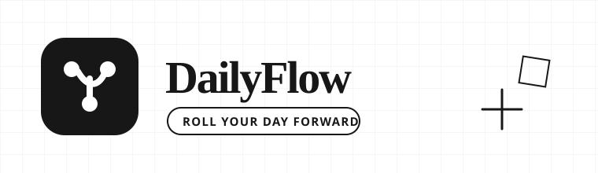

<div align="center">



# DailyFlow

**A local-first intelligent planner for Markdown-native workflows.**  
DailyFlow turns daily Markdown notes into an auto-rolling, project-aware, mindmap-assisted task workspace.

[简体中文](./README.md) | __English__


[Product Spec](./PRODUCT.md) · [MVP Spec](./docs/MVP_SPEC.md) · [Data Format](./docs/DATA_FORMAT.md) · [Architecture](./docs/ARCHITECTURE.md) · [UI Guide](./docs/UI_DESIGN.md) · [DINQ Style Translation](./docs/DESIGN_REFERENCE_DINQ.md) · [Roadmap](./docs/ROADMAP.md)

</div>

---

## Positioning

DailyFlow is not another closed todo app. It is built for people whose schedules change every day, whose tasks often span weeks or months, and who still want Markdown and Git to remain the foundation of their workflow.

- Daily Markdown files remain the source of truth and stay readable in Obsidian.
- Unfinished tasks automatically roll over to the next day.
- Long-running tasks become project files with progress, notes, and daily touchpoints.
- Complex work can be decomposed with mindmaps, then converted into executable tasks.
- Data is local by default. SQLite is only an index; GitHub is optional sync and backup.

## Core Capabilities

| Capability | Description | MVP Priority |
|---|---|---|
| Auto rollover | Extract unfinished tasks from the previous day and create today's note | P0 |
| Markdown task model | Tasks, subtasks, deadlines, schedules, priorities, attachments, links | P0 |
| Daily view | Browse today, tomorrow, and historical notes; complete/edit/defer tasks | P0 |
| Long projects | Project files, progress logs, and daily project touchpoints | P1 |
| Mindmaps | Decompose work visually and convert selected nodes into tasks | P1 |
| Git sync | Local commit, push, pull, and conflict warnings | P1 |
| Attachment management | Bind files, URLs, and notes to tasks with global search | P1 |

## Suggested Stack

```text
Frontend   React + TypeScript + Vite
Backend    Python + FastAPI
Data       Markdown files as source of truth + SQLite index
Mindmap    React Flow / markmap-compatible export
Sync       Git CLI wrapper + optional GitHub remote
Deploy     Docker Compose for private deployment
```

## Documentation

```text
DailyFlow/
├── README.md
├── README_EN.md
├── PRODUCT.md
└── docs/
    ├── MVP_SPEC.md
    ├── DATA_FORMAT.md
    ├── ARCHITECTURE.md
    ├── UI_DESIGN.md
    ├── DESIGN_REFERENCE_DINQ.md
    ├── ROADMAP.md
    └── assets/logo.svg
```

> This repository is currently at the product design stage. It intentionally does not include fake screenshots. Once the MVP runs locally, screenshots should be captured from the real localhost app with Playwright and stored in `docs/assets/`.
