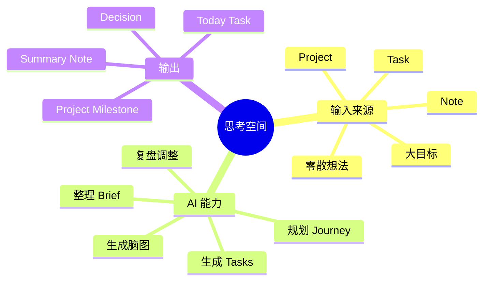

# DailyFlow 思考工作台设计

> 目标：把 DailyFlow 从「任务列表」升级为「目标 / 事项 / 任务的思考与执行系统」。思考工作台不依附于某个 task；它是一等对象，可以从一个大目标、一段想法、一个项目、一个 note 或一个普通 task 创建。Task 只是工作台里拆出来的可执行行动项。

---

## 1. 核心判断

之前把工作台理解成「复杂 task 的详情页」仍然太窄。更准确的模型是：

```text
Thinking Workspace = 一个需要被想清楚、拆清楚、推进清楚的事项空间
Task = Thinking Workspace 里产出的最小行动颗粒
```

用户真实工作流通常不是从 task 开始的，而是从这些东西开始：

| 起点 | 示例 | 后续产物 |
|---|---|---|
| 一个大目标 | 完成融资材料、准备产品发布、规划年度路线 | 计划、阶段、多个 task、资料清单 |
| 一个模糊想法 | DailyFlow 现在功能性有限，可能需要脑图 | brief、问题定义、方案选择 |
| 一个项目 | SecondPlanet 上线、客户 PoC、投融资资料 | 多个工作台、里程碑、项目任务 |
| 一段 note | 一次会议后产生很多行动和判断 | 总结、决策、跟进 task |
| 一个普通 task | 写 proposal，但越想越复杂 | 升级为工作台，再拆子任务 |

所以产品里应该区分三层：

```text
Project / Area       长期主题或容器，例如 DailyFlow、融资、生活管理
Thinking Workspace   一段需要思考和推进的事项，例如「设计任务思考系统」
Task                 今天或某天可以执行的一步，例如「画第一版 wireframe」
```

DailyFlow 的核心体验应该变成：

```text
捕获一个目标 / 想法 / 事项
    ↓
进入思考工作台
    ↓
收集零散想法、资料、疑问、限制
    ↓
AI 帮你整理成 brief、路径、脑图
    ↓
从路径里挑出今天要做的小 task
    ↓
每天执行、记录、复盘、调整
```

---

## 2. 新增一等对象：Thinking Workspace

### 2.1 定义

**Thinking Workspace（思考工作台）** 是 DailyFlow 里的独立对象，用来承载一个「需要想清楚并持续推进的事项」。它可以关联 task，但不属于 task。

它可以是：

- 一个目标：例如「三个月内完成融资资料」。
- 一个问题：例如「DailyFlow 如何变得更有用」。
- 一个方案：例如「做任务脑图和 AI 规划」。
- 一个阶段性事项：例如「准备下周客户演示」。
- 一个从 task 升级来的复杂行动：例如「写 pitch deck」升级后变成完整工作台。

### 2.2 与 task 的关系

思考工作台和 task 是双向但松耦合的关系：

```text
Thinking Workspace
├── 可以生成多个 tasks
├── 可以关联已有 tasks
├── 可以把某个 task 标记为 next action
├── 可以把 task 完成情况纳入复盘
└── 不因为 task 完成就自动结束
```

这点很重要：

- 一个工作台可能持续数周，但每天只生成 1-3 个小 task。
- 一个 task 完成后，工作台还会继续存在，用于沉淀判断和下一步。
- 一个工作台可以没有 task，纯粹用于脑暴、分析、研究。
- 一个普通 task 也可以在变复杂时「升级为工作台」。

### 2.3 推荐命名

界面上不要叫得太技术化，可以用：

| 场景 | 文案 |
|---|---|
| 顶级导航 | Workspaces / 思考空间 |
| 新建按钮 | 新建思考空间 |
| 从 task 创建 | 升级为思考空间 |
| 从 note 创建 | 从这段内容创建思考空间 |
| AI 动作 | 帮我理清这件事 |
| task 产出 | 生成下一步任务 |

---

## 3. 工作台内容结构

一个 Thinking Workspace 包含：

| 模块 | 用途 | 典型内容 |
|---|---|---|
| Intent | 这个空间到底想解决什么 | 目标、问题、范围、成功标准 |
| Scratchpad | 零散想法收集区 | 随手想法、链接、会议结论、疑问 |
| Brief | AI 整理后的结构化摘要 | 背景、核心判断、约束、缺失信息 |
| Journey / Plan | 完成路径 | 阶段、里程碑、依赖、风险、下一步 |
| Tasks | 具体行动项 | 今天做什么、下次做什么、已完成什么 |
| Mind Map | 脑图视图 | 目标、路径、资料、风险、问题、决策 |
| Timeline | 推进记录 | 每天做了什么、卡在哪里、AI 调整建议 |
| Linked Material | 关联资料 | notes、meeting notes、summary、文件、URL |

注意：这里的 Tasks 是工作台的产物，而不是工作台的父级。

---

## 4. 信息架构调整

原来是：

```text
Today
Projects
Notes
Tasks
```

建议改成：

```text
Today             今天要执行的行动
Workspaces        正在思考和推进的事项
Projects          长期项目 / 主题容器
Notes             沉淀资料和总结
```

关系是：

```text
Project / Area
   └── Workspace A
        ├── Task 1 -> 出现在 Today
        ├── Task 2 -> 安排到明天
        ├── Note 1 -> 会议记录
        └── Mind Map -> 思考结构
```

Today 仍然是执行中心，但 Workspaces 是思考中心。

---

## 5. 创建入口

思考工作台应该可以从多个地方创建，而不是只能从 task 创建。

### 5.1 从全局捕获创建

用户按 `Cmd+K` 写：

```text
我觉得 DailyFlow 的任务功能有点薄，需要能做脑图、规划、整理零散想法。
```

AI 提示：

```text
这看起来像一个需要持续思考的事项。
要创建一个思考空间吗？

标题：增强 DailyFlow 的任务思考能力
类型：产品设计
建议下一步：梳理用户场景、设计工作台模型、画 wireframe
```

### 5.2 从 task 升级

用户有一个 task：

```markdown
- [ ] 设计 DailyFlow 的 AI 任务规划能力 #product
```

如果它变复杂，点击「升级为思考空间」。原 task 保留在 Today，但增加回链：

```markdown
- [ ] 设计 DailyFlow 的 AI 任务规划能力 #product
  workspace: [[Workspaces/2026/06/dailyflow-ai-task-planning.md]]
```

### 5.3 从 note 创建

会议记录里有一段：

```markdown
客户希望我们下周给一个完整 PoC 方案，需要包含部署、权限、知识库、验收标准。
```

用户选中后点击「创建思考空间」，生成：

```text
Workspace: 客户 PoC 方案准备
Linked Note: 这次会议记录
Suggested Tasks: 梳理需求、列验收标准、准备 demo 环境
```

### 5.4 从 project 创建

项目页里点击「新建思考空间」：

```text
Project: DailyFlow
Workspace: 设计 Workspaces 模块
```

项目聚合多个 workspace，而不是直接塞满 task。

---

## 6. AI 应该做什么

AI 的角色是「思考整理和执行转译」，不是替用户直接决定。

### 6.1 帮我理清这件事

输入：Intent、Scratchpad、linked notes、已有 tasks。

输出：

- 这件事的目标是什么
- 背景和关键约束
- 已知信息 / 缺失信息
- 可能的路径
- 当前最该澄清的问题

按钮文案：**帮我理清这件事**

### 6.2 规划推进旅程

输入：Brief、deadline、project context、用户可用时间。

输出：

- 阶段划分
- 每阶段产出
- 依赖关系
- 风险和应对
- 本周重点
- 今天可以做的最小行动

按钮文案：**规划推进路径**

### 6.3 生成下一步任务

输入：Journey / Plan。

输出：可勾选的 tasks，用户确认后可写入：

- Today
- 某个未来日期
- 当前 workspace 的 Tasks 区
- 所属 project 的任务区

规则：

- 不自动覆盖已有 task。
- 生成结果先进入 preview。
- 每个 task 都要足够小，最好 15-60 分钟能推进。

按钮文案：**生成下一步任务**

### 6.4 生成 / 更新脑图

输入：Intent + Brief + Scratchpad + Plan。

输出：Mind map 节点和关系。

节点类型：

| 节点类型 | 说明 |
|---|---|
| goal | 核心目标 |
| context | 背景和上下文 |
| idea | 零散想法 |
| task | 可执行任务 |
| risk | 风险 |
| resource | 资料或链接 |
| question | 待澄清问题 |
| decision | 已确定决策 |

按钮文案：**生成脑图** / **根据新进展更新脑图**

### 6.5 复盘和调整

输入：Timeline、完成/未完成 tasks、最新 scratchpad。

输出：

- 已完成进展
- 当前阻塞点
- 原计划是否需要调整
- 下一步最小行动
- 可删除、延期或合并的任务

按钮文案：**复盘并调整下一步**

---

## 7. 界面草图

```text
┌──────────────────────────────────────────────────────────────┐
│ ← Workspaces / DailyFlow                                      │
│                                                              │
│  增强 DailyFlow 的任务思考能力                    #product    │
│  类型: 产品设计   状态: 探索中   所属项目: DailyFlow          │
│                                                              │
│  [帮我理清这件事] [规划推进路径] [生成下一步任务] [生成脑图]   │
├──────────────────────────────────────────────────────────────┤
│                                                              │
│  左侧：输入和过程                         右侧：结构化输出   │
│  ┌──────────────────────────────┐       ┌─────────────────┐ │
│  │ Intent                        │       │ Brief           │ │
│  │ 我想让复杂事项不只是 task...  │       │ 核心问题：...   │ │
│  └──────────────────────────────┘       └─────────────────┘ │
│  ┌──────────────────────────────┐       ┌─────────────────┐ │
│  │ Scratchpad                    │       │ Journey         │ │
│  │ - 需要脑图                    │       │ 1. 明确模型     │ │
│  │ - 需要子任务                  │       │ 2. 设计入口     │ │
│  │ - 不一定依附于 task           │       │ 3. 做 AI preview│ │
│  └──────────────────────────────┘       └─────────────────┘ │
│  ┌──────────────────────────────┐       ┌─────────────────┐ │
│  │ Timeline                      │       │ Tasks           │ │
│  │ 06-18 重新定义为一等对象      │       │ ☐ 更新模型文档  │ │
│  └──────────────────────────────┘       │ ☐ 画 wireframe   │ │
│                                         └─────────────────┘ │
├──────────────────────────────────────────────────────────────┤
│  Mind Map                                                     │
│                                                              │
│             [思考空间]                                        │
│          /      |       \                                      │
│   [输入来源] [AI 整理] [行动输出]                              │
│      |          |          \                                   │
│   [task/note] [brief/plan] [today tasks]                       │
│                                                              │
└──────────────────────────────────────────────────────────────┘
```

---

## 8. Markdown 数据设计

DailyFlow 仍然应该坚持 Markdown-first。Thinking Workspace 独立落到 `Workspaces/`，而不是 `Tasks/`。

### 8.1 Workspace 文件

````markdown
---
id: ws_20260618_dailyflow_thinking
kind: workspace
type: product_design
status: active
project: dailyflow
tags: [product, ai, mindmap]
createdAt: 2026-06-18T10:00:00+08:00
updatedAt: 2026-06-18T10:00:00+08:00
linkedTasks: []
linkedNotes: []
---

# 增强 DailyFlow 的任务思考能力

## Intent

让 DailyFlow 支持独立的思考空间，而不是把复杂思考强行塞进某一个 task。

## Scratchpad

- 用户觉得当前功能不错，但功能性有限。
- 复杂事项需要脑图、子任务、零散思路整理。
- 这个空间不一定依附于 task；可能是大目标下面拆出很多小 task。

## Brief

核心判断：思考空间应该是一等对象，task 是从空间里生成的行动项。

## Journey

1. 定义 Workspace / Project / Task 三层关系。
2. 设计从 task、note、project、Cmd+K 创建 workspace 的入口。
3. 接入 AI 整理、规划、任务生成和脑图生成。
4. 打通 workspace 与 Today 的任务投放。

## Tasks

- [ ] 更新产品文档里的数据模型
- [ ] 设计 Workspaces 顶级导航
- [ ] 设计「生成下一步任务」preview

## Mind Map



## Timeline

### 2026-06-18

- 重新定义：思考工作台不依附于 task，而是一等对象。
````

### 8.2 Daily task 中的可选回链

```markdown
- [ ] 画 Workspaces 第一版 wireframe #product
  workspace: [[Workspaces/2026/06/dailyflow-thinking.md]]
```

### 8.3 Note 中的可选回链

```markdown
related_workspaces:
  - [[Workspaces/2026/06/customer-poc-plan.md]]
```

---

## 9. 数据模型扩展

```ts
export type ThinkingWorkspace = {
  id: string;
  title: string;
  kind: 'workspace';
  type?: 'goal' | 'problem' | 'research' | 'product_design' | 'project_phase' | 'general';
  status: 'active' | 'paused' | 'completed' | 'archived';
  projectId?: string;
  intent: string;
  scratchpad: string;
  brief?: string;
  journey?: string;
  taskIds: string[];
  linkedNoteIds: string[];
  mindmap?: MindMapDocument;
  timeline: WorkspaceTimelineEntry[];
  createdAt: string;
  updatedAt: string;
  filePath?: string;
};

export type WorkspaceTimelineEntry = {
  id: string;
  date: string;
  body: string;
  type: 'log' | 'decision' | 'blocker' | 'ai_review';
};
```

---

## 10. 与现有功能的关系

| 现有功能 | 升级方式 |
|---|---|
| Today | 只显示可执行 task，同时标出它来自哪个 workspace |
| TaskCard | 增加「关联 / 升级为思考空间」入口 |
| Notes | 可从选中文本创建 workspace，也可作为 linked material |
| Projects | 项目聚合多个 workspace，再由 workspace 产出 tasks |
| AIChat / FloatingAIPanel | 变成 workspace-aware assistant，知道当前事项上下文 |
| Rollover | 迁移 task 时保留 workspace 回链，不复制整个 workspace |
| PromptLibrary | 增加工作台类 prompt：理清事项、规划路径、生成任务、生成脑图、复盘调整 |

---

## 11. 分阶段实现建议

### Phase A：独立 Workspaces

目标：先让用户可以新建一个不依附 task 的思考空间。

- 新增 Workspaces 顶级入口。
- 新建 `Workspaces/` Markdown 文件。
- 支持 Intent、Scratchpad、Brief、Journey、Tasks、Timeline。
- 支持从 task / note / project / Cmd+K 创建 workspace。

### Phase B：Workspace → Task

目标：把思考自然转成执行。

- `生成下一步任务`：从 Journey 生成 task preview。
- 用户选择投放到 Today、未来日期或项目。
- Today task 显示来源 workspace。
- 完成 task 后同步到 workspace timeline。

### Phase C：AI 整理和脑图

目标：让 AI 真正服务于思考结构。

- `帮我理清这件事`：从 scratchpad 生成 brief。
- `规划推进路径`：从 brief 生成 journey。
- `生成脑图`：从 intent / brief / journey 生成 Mermaid mindmap。
- 所有 AI 输出都先进入 preview，不直接覆盖。

### Phase D：项目聚合和长期复盘

目标：让大项目由多个 workspace 组成。

- 项目页展示 active workspaces。
- 每个 workspace 显示状态、阻塞、next action。
- AI 支持跨 workspace 复盘项目进度。

---

## 12. 一句话新版定位

DailyFlow 不只是每天的 todo list，而是一个本地优先的「思考空间 + 行动任务」系统：你可以先围绕一个目标或问题搭建思考空间，再让 AI 帮你整理、规划、生成脑图和投放下一步任务。
